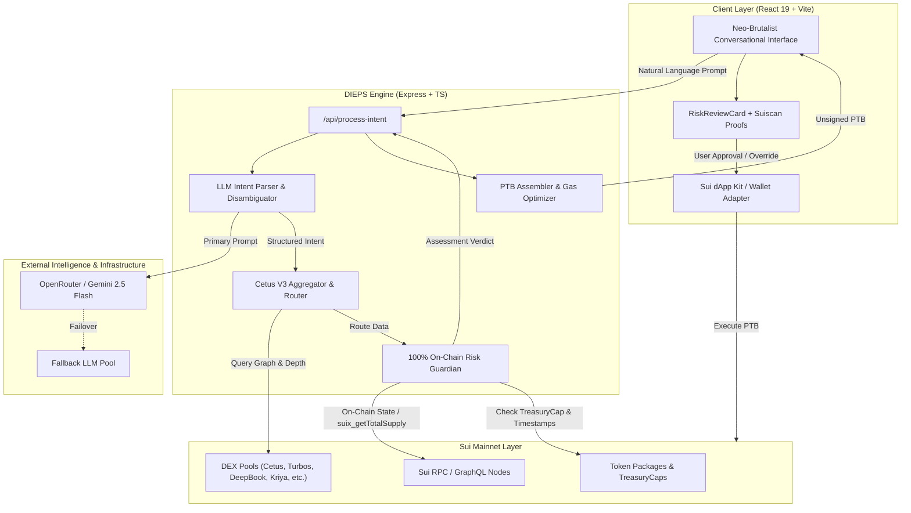
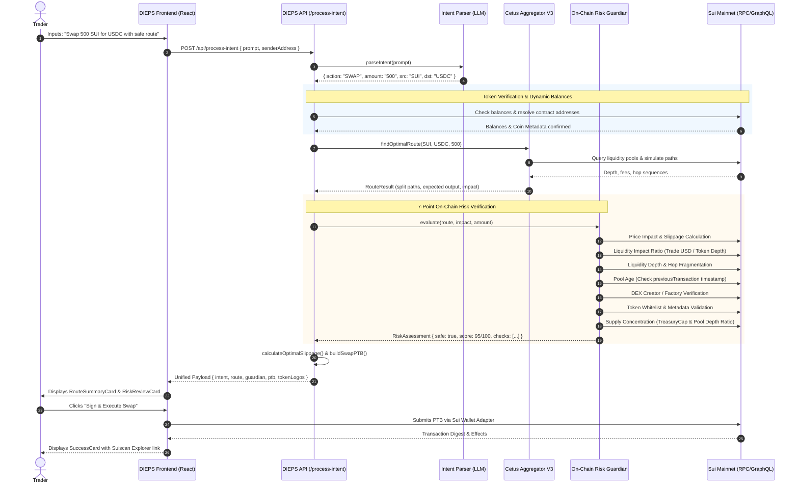
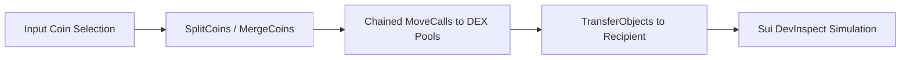

# 🧠 DIEPS: Comprehensive Technical & Architecture Report
**Decentralized Intent Execution Protocol System on Sui Mainnet**

---

## Executive Summary

The **Decentralized Intent Execution Protocol System (DIEPS)** is an AI-orchestrated liquidity intelligence and execution layer deployed on the Sui Network. Traditional decentralized exchange (DEX) aggregators impose severe cognitive overhead on users: manual token contract verification, route analysis, liquidity pool depth inspection, slippage estimation, and manual slippage parameterization. These manual hurdles frequently expose retail and institutional capital to high slippage, MEV sandwich attacks, stale/abandoned pool execution, and malicious token rug-pulls.

**DIEPS resolves these challenges by replacing manual transactional interfaces with a deterministic Intent-Driven Execution Pipeline:**
1. **Natural Language Intent Parsing**: Transcribing plain conversational prompts into structured trading parameters via Google Gemini / OpenRouter with resilient multi-tier fallback chains.
2. **Autonomous Route Optimization**: Seamlessly interfacing with the **Cetus Aggregator V3 SDK** to discover multi-hop arbitrage paths and split-route executions across 8+ major Sui DEX protocols.
3. **100% On-Chain Risk Guardian**: A zero-external-indexer safety engine running 7 distinct mathematical and on-chain structural audits (including TreasuryCap infinite-mint tracing and on-chain timestamp verification).
4. **Dynamic On-Chain Slippage Engine**: Mathematically parameterized slippage calculations factoring in live route depth, trade volume ratios, and hop counts.
5. **Atomic PTB Assembly**: Compiling validated execution paths into Sui **Programmable Transaction Blocks (PTB)** ready for wallet signatures.

---

## Table of Contents

1. [System Architecture & End-to-End Workflow](#1-system-architecture--end-to-end-workflow)
2. [Subsystem 1: Natural Language Intent Engine](#2-subsystem-1-natural-language-intent-engine)
3. [Subsystem 2: Smart Routing & Mathematical Pool Modeling](#3-subsystem-2-smart-routing--mathematical-pool-modeling)
4. [Subsystem 3: 100% On-Chain Risk Guardian (7-Point Assessment)](#4-subsystem-3-100-on-chain-risk-guardian-7-point-assessment)
5. [Subsystem 4: Dynamic Slippage & Gas Optimization](#5-subsystem-4-dynamic-slippage--gas-optimization)
6. [Subsystem 5: Programmable Transaction Block (PTB) Assembler](#6-subsystem-5-programmable-transaction-block-ptb-assembler)
7. [Subsystem 6: Frontend Architecture & Conversational Neo-Brutalist UX](#7-subsystem-6-frontend-architecture--conversational-neo-brutalist-ux)
8. [Security & Threat Mitigation Matrix](#8-security--threat-mitigation-matrix)
9. [Performance, Latency & Caching Strategies](#9-performance-latency--caching-strategies)
10. [Competitive Benchmarking & Ecosystem Impact](#10-competitive-benchmarking--ecosystem-impact)

---

## 1. System Architecture & End-to-End Workflow

The DIEPS architecture couples an Express TypeScript backend with a React 19 / Vite frontend, interfacing directly with Sui Mainnet fullnodes via `@mysten/sui` and the Cetus Aggregator V3 SDK.

### 1.1 High-Level Architecture



### 1.2 End-to-End Sequence Flow



---

## 2. Subsystem 1: Natural Language Intent Engine

The Intent Engine eliminates UI friction by allowing conversational input. Built in `backend/src/services/llm/intentParser.ts`, it extracts quantitative and qualitative constraints into a typed `ParsedIntent` payload.

### 2.1 Intent Normalization Schema

```typescript
export interface ParsedIntent {
  action_type: 'SWAP';
  source_token_symbol: string;
  source_token_address?: string;
  destination_token_symbol: string;
  destination_token_address?: string;
  trade_amount: string; // "1000", "ALL", "MAX", "50%", or "MISSING"
  priority_mode: 'SAFE' | 'FAST' | 'MAX_OUTPUT';
  constraints: Array<{
    type: 'MAX_SLIPPAGE' | 'DEADLINE' | 'PREFER_DEX';
    value: string | number;
  }>;
}
```

### 2.2 Resilient Multi-Tier LLM Fallback Chain
To guarantee uninterrupted service during high-traffic demos or upstream model rate-limits, DIEPS implements an automatic failover sequence:

$$\text{Primary Model} \xrightarrow{\text{on failure}} \text{Fallback Model 1} \xrightarrow{\text{on failure}} \text{Fallback Model 2} \xrightarrow{\text{on failure}} \text{Deterministic Parsing}$$

*   **Primary Candidate**: `OPENROUTER_MODEL` (e.g. `google/gemini-2.5-flash` or `openai/gpt-4o-mini`).
*   **Fallback Candidates**: Configurable list via `OPENROUTER_FALLBACK_MODELS` (e.g., Nemotron, Claude 3.5 Haiku).
*   **JSON Sanitizer**: A robust state-machine parser (`extractFirstJsonObject`) inspects character depths, string escapes, and brackets, stripping out markdown formatting fences and non-JSON preamble text.

### 2.3 Dynamic Balance Resolution & Gas Preservation
When a user specifies dynamic amounts (such as *"Swap ALL SUI"*, *"Swap MAX"*, or *"Trade 50% of my DEEP"*), DIEPS queries the wallet balance in real-time via `resolveDynamicAmount()`:
*   Reads token balance on-chain through `getBalance(walletAddress, coinType)`.
*   Multiplies by fraction (1.0 for ALL/MAX, $N/100$ for percentages).
*   **Critical Safety Margin**: If the source asset is SUI (`0x2::sui::SUI`), the engine enforces `RISK_THRESHOLDS.router.gasReserveSui = 0.1 SUI` reservation to guarantee that subsequent transaction execution gas fees will never fail due to balance exhaustion.

### 2.4 Token Disambiguation & Alternative Funding Suggestions
*   **Disambiguation**: In crypto ecosystems, duplicate ticker symbols are common scam vectors. If a token is not in the curated whitelist (`TOKEN_WHITELIST`) and no contract address was supplied, `searchTokenCandidates()` fetches up to 8 candidate coins from the on-chain registry. The system presents the user with an interactive `TokenSuggestionCard` with on-chain verification flags, coin decimals, and 1-click substitute prompt buttons.
*   **Alternative Funding Sources (`findAlternativeSources`)**: If the user's wallet balance of the selected token is insufficient, DIEPS scans the wallet for other liquid tokens holding sufficient USD value to fulfill the trade, suggesting alternative route combinations.

---

## 3. Subsystem 2: Smart Routing & Mathematical Pool Modeling

The routing core (`backend/src/services/router/cetusRouter.ts`) wraps the **Cetus Aggregator V3 SDK** (`@cetusprotocol/aggregator-sdk`), traversing liquidity across Cetus, Turbos, DeepBook V3, Kriya, FlowX, Aftermath, and Bluefin.

### 3.1 Mathematical Active TVL Calculation

Many AMMs on Sui (such as Cetus and DeepBook) utilize Concentrated Liquidity (CLMM) or central limit order books. Traditional TVL metrics often misrepresent available swap depth. DIEPS reads raw pool fields directly through `sui_multiGetObjects` and computes the **Active Effective TVL**:

#### For Concentrated Liquidity (CLMM Pools)
Given liquidity units $L$, token decimals $\text{dec}_x$ and $\text{dec}_y$, and live on-chain token prices $P_x$ and $P_y$:

$$\text{avgDec} = \frac{\text{dec}_x + \text{dec}_y}{2}$$

$$L_{\text{standard}} = \frac{L}{10^{\text{avgDec}}}$$

$$\text{TVL}_{\text{active}} = 2 \cdot L_{\text{standard}} \cdot \sqrt{P_x \cdot P_y}$$

#### For Orderbook Pools (DeepBook V3)
Given base reserve $B_x$ and quote reserve $B_y$:

$$\text{TVL}_{\text{orderbook}} = \left(\frac{B_x}{10^{\text{dec}_x}} \cdot P_x\right) + \left(\frac{B_y}{10^{\text{dec}_y}} \cdot P_y\right)$$

#### Empirical Hop TVL Approximation
If structural pool data is withheld by an aggregator node, DIEPS reconstructs effective TVL using observed slippage deviation:

$$\text{TVL}_{\text{effective}} = \min\left(\frac{2 \cdot \text{Trade}_{\text{USD}}}{\max(0.0001, \text{Observed Price Impact})},\; \$10{,}000{,}000\right)$$

---

## 4. Subsystem 3: 100% On-Chain Risk Guardian (7-Point Assessment)

Implemented in `backend/src/services/risk/LiquidityRiskGuardian.ts`, `PoolSafety.ts`, and `TokenSafety.ts`, the Risk Guardian operates without any third-party closed-source indexers. Every check is derived from direct Sui RPC and Move package state.

```
+-------------------------------------------------------------------------------+
|                       100% ON-CHAIN RISK GUARDIAN                             |
+-------------------------------------------------------------------------------+
| 1. Price Impact & Slippage Risk       | Effective Impact vs mathematical curve |
| 2. Liquidity Impact Ratio             | Trade Size relative to Token Depth    |
| 3. Liquidity Depth & Fragmentation    | Hop Count & Pool Utilization Ratio    |
| 4. Pool Age & Stale Activity          | On-chain previousTransaction timestamp|
| 5. DEX Creator Verification           | Verified Factory Deployer Address     |
| 6. Token Whitelist & Metadata         | CoinMetadata & Sui Native verification|
| 7. Dual-Layer Supply Concentration    | TreasuryCap Owner & Pool Supply Ratio |
+-------------------------------------------------------------------------------+
```

### 4.1 Detailed Breakdown of the 7 Checks

#### Check 1: Price Impact & Slippage Risk
Calculates simulated execution impact against cumulative route fees:

$$\text{Effective Impact} = \max\left(\text{Simulated Impact}_\%,\; \sum (\text{Pool Fee}_\%) \times 0.5\right)$$

*   **SAFE**: Effective Impact $< 1.0\%$
*   **WARNING**: $1.0\% \le \text{Effective Impact} < 3.0\%$ (Moderate impact)
*   **WARNING (SPLIT)**: $3.0\% \le \text{Effective Impact} < 5.0\%$ (Recommend splitting trade)
*   **DANGER**: $\ge 5.0\%$ (**Blocks execution**; severe value loss)

#### Check 2: Liquidity Risk (Trade Impact Ratio)
Decouples absolute pool TVL from trade size:

$$\text{Token Depth}_{\text{USD}} = \frac{\text{Pool TVL}}{2}$$

$$\text{Impact Ratio} = \frac{\text{Trade Amount} \times P_{\text{token}}}{\text{Token Depth}_{\text{USD}}}$$

*   **SAFE**: $\text{Impact Ratio} \le 5\%$
*   **WARNING**: $5\% < \text{Impact Ratio} \le 20\%$ (High slippage expected)
*   **DANGER**: $> 20\%$ (**Blocks execution**; high risk of frontrunning / sandwich attacks)

#### Check 3: Liquidity Depth & Route Fragmentation
*   Evaluates hop count $H$. If $H > 3$, routes liquidity through too many intermediary hops, compounding swap fees and execution failure risk.
*   Assesses pool utilization ratio $\frac{\text{Trade Amount}}{\text{Pool Liquidity}} > 30\% \rightarrow$ WARNING.

#### Check 4: Pool Age & Staleness (Abandonment Check)
DEX pools that have had no transactions for days or weeks often suffer from stale price curves and liquidity drains.
*   Traces each pool ID through `sui_getObject` with `showPreviousTransaction: true`.
*   Retrieves timestamp of the last confirmed transaction block: $T_{\text{last}}$.
*   Calculates elapsed time: $\Delta_{\text{days}} = \frac{\text{Now} - T_{\text{last}}}{86{,}400{,}000}$.
*   **SAFE**: $\Delta_{\text{days}} \le 3\text{ days}$
*   **WARNING**: $3\text{ days} < \Delta_{\text{days}} \le 7\text{ days}$
*   **DANGER**: $> 7\text{ days}$ (Stale, abandoned pool)

#### Check 5: DEX Verification
Verifies pool deployer contracts against known audited Sui DEX protocols (`CETUS_SUPPORTED_DEXES` and `KNOWN_DEX_CREATORS`):
*   Cetus (`0x1eabed...`), Turbos (`0x91bfbc...`), DeepBook (`0xdee9`), Kriya (`0xa0eba1...`), FlowX (`0xba1531...`), Aftermath (`0x7f6ce7...`).

#### Check 6: Token Safety & Whitelist
*   Recognizes Sui Native coin struct (`0x2::sui::SUI`) as intrinsically verified.
*   Validates whether symbol and package ID exist within verified `TOKEN_WHITELIST`.
*   For non-whitelisted coins, executes on-chain `getCoinMetadata()` query.

#### Check 7: Dual-Layer Supply Concentration & Rug-Pull Detection
For unwhitelisted or new tokens, DIEPS runs two on-chain checks:
*   **Layer A (TreasuryCap Ownership Check)**: Traces the token package creation transaction digest, locates `0x2::coin::TreasuryCap<T>`, and inspects its owner:
    *   If `owner.AddressOwner` is present $\rightarrow$ **DANGER**: Deployer retains infinite minting authority.
    *   If `TreasuryCap` is burned or wrapped in a shared protocol $\rightarrow$ **SAFE**: Supply is immutable.
*   **Layer B (Pool Concentration Ratio)**:
    $$\text{Supply Ratio} = \frac{\text{Token Depth in Pool}}{\text{Total Supply on Chain}} \times 100\%$$
    *   If $\text{Supply Ratio} < 0.05\% \rightarrow$ **DANGER**: Over $99.95\%$ of the total circulating supply is held in private developer wallets (extreme rug-pull probability).

### 4.2 Scoring Formula & Verdict Classification

Starting with a base score of $100$:

$$\text{Final Score} = 100 - \sum (N_{\text{DANGER}} \times 25) - \sum (N_{\text{WARNING}} \times 10)$$

$$\text{Score} = \text{clamp}(0, 100, \text{Final Score})$$

| Final Score | Risk Tier | Actionable Verdict | Execution Status |
|:---:|:---:|:---|:---:|
| **$80 - 100$** | **LOW** | Route verified safe on-chain. | **Allowed (Green)** |
| **$60 - 79$** | **MEDIUM** | Minor warnings (e.g. moderate slippage). | **Allowed with notices** |
| **$30 - 59$** | **HIGH** | Multiple risk factors detected. | **Explicit User Override Required** |
| **$< 30$** | **CRITICAL** | Severe danger (infinite mint, massive impact). | **Execution Blocked** |

*Note: Execution is strictly blocked regardless of overall score if any Critical Danger (e.g. Price Impact $\ge 5\%$) is triggered.*

---

## 5. Subsystem 4: Dynamic Slippage & Gas Optimization

Traditional aggregators use a static $0.5\%$ slippage tolerance, leading to frequent transaction reverts in volatile markets or sandwich attacks in shallow pools. DIEPS dynamically derives the optimal slippage parameter directly from on-chain liquidity parameters.

### 5.1 Dynamic Slippage Formula

$$\text{Optimal Slippage} = \text{base} + (\text{Price Impact} \times \alpha) + \left(\frac{\text{Trade}_{\text{USD}}}{\text{Total Liquidity}_{\text{USD}}} \times \beta \times 100\right) + (H \times \gamma)$$

Where configured in `RISK_THRESHOLDS.slippage`:
*   $\text{base} = 0.1\%$ (minimum price motion buffer).
*   $\alpha = 1.5$ (simulated execution impact multiplier).
*   $\beta = 2.0$ (trade-to-liquidity ratio sensitivity factor).
*   $\gamma = 0.15\%$ (per-hop cross-pool execution risk).
*   $\text{Clamped Range}: [0.1\%, 15.0\%]$.

If the user explicitly inputs a custom slippage constraint (e.g., *"slippage 0.2%"*), the system honors user preference while enforcing the safety boundaries.

---

## 6. Subsystem 5: Programmable Transaction Block (PTB) Assembler

Once validated, the route is handed to `backend/src/services/router/ptbBuilder.ts` to construct the serializable Sui PTB.

### 6.1 Transaction Construction Architecture



1. **Coin Management**:
   * If source is SUI: Employs `SplitCoins` off the primary gas coin.
   * If source is secondary coin (e.g. USDC): Invokes `MergeCoins` across UTXO objects owned by the sender.
2. **MoveCall Hop Sequencing**:
   * Dispatches exact-in swap calls targeting the verified DEX package IDs (`cetus::swap::exact_in`, `turbos::swap`, etc.).
   * Feeds output object from hop $k$ as the input parameter to hop $k+1$.
3. **Execution Dry-Run**:
   * Evaluates reference gas price via `suix_getReferenceGasPrice`.
   * Estimates transaction cost based on $5{,}000{,}000\text{ MIST}$ baseline multiplied by reference gas price.

---

## 7. Subsystem 6: Frontend Architecture & Conversational Neo-Brutalist UX

The frontend is implemented with React 19, Tailwind CSS v4, Lucide icons, and Framer Motion, utilizing a distinct **Playground Neo-Brutalist ("Toon")** aesthetic.

```
+-----------------------------------------------------------------------------------+
|  [WAPCHAT.EXE * BUDDY IS TYPING...]                           SUI * SAFE * FUN   |
+-----------------------------------------------------------------------------------+
|  Conversation Panel                                                               |
|                                                                                   |
|  [User Bubble]: "Swap 100 SUI for CETUS"                                          |
|                                                                                   |
|  [IntentParserCard]:                                                              |
|   -> 100 SUI -> CETUS | Priority: SAFE                                            |
|                                                                                   |
|  [RouteSummaryCard]:                                                              |
|   -> Cetus Pool (100%) -> Fee: 0.25% | Slippage: 0.35%                            |
|   -> Expected: 482.12 CETUS                                                       |
|                                                                                   |
|  [RiskReviewCard]:                                                                |
|   -> Overall Score: 95/100 (LOW RISK)                                             |
|   -> Pills: [Slippage: SAFE] [Concentration: SAFE] [Pool Health: SAFE]            |
|   -> On-Chain Proofs: [Suiscan: Pool 0x1eab...] [Coin: 0x068...]                  |
|                                                                                   |
|  [Sign & Execute Swap Button]                                                      |
+-----------------------------------------------------------------------------------+
```

### 7.1 Modular Card Hierarchy

1. **`IntentParserCard.tsx`**: Displays extracted parameters, normalized tokens, dynamic amounts, and user priorities.
2. **`RouteSummaryCard.tsx`**: Renders the multi-hop routing graph with fee breakdowns, estimated output, price impact, and optimal slippage.
3. **`RiskReviewCard.tsx`**:
   * Displays 3-5 sentence plain-English risk breakdown.
   * Color-coded category pills (`Slippage`, `Concentration`, `Pool Health`, `Token Safety`).
   * Expandable inspection accordion exposing all 7 individual checks.
   * Interactive Suiscan explorer deep-links for every inspected pool and coin contract.
   * Interactive acknowledgment checkbox required for any flagged high-risk trades.
4. **`TokenSuggestionCard.tsx`**: Triggered upon ambiguous symbol entry; provides 1-click retry buttons with verified contract types.
5. **`AlternativeSourceCard.tsx`**: Alerts users when source asset balance is low and offers alternatives from current holdings.

---

## 8. Security & Threat Mitigation Matrix

| Attack / Risk Vector | Conventional Aggregator Behavior | DIEPS Guardian Mitigation |
|:---|:---|:---|
| **Infinite Mint Rug-Pull** | Unaware; executes trade, resulting in total loss. | Traces `TreasuryCap` creation on-chain; blocks execution if owned by deployer `AddressOwner`. |
| **Developer Token Hoarding** | Ignores distribution; routes trade. | Evaluates pool depth vs total circulating supply; flags warning if pool holds $< 1\%$ and blocks if $< 0.05\%$. |
| **Stale / Drained Pool Trap** | Routes through abandoned pool with skewed pricing. | Traces `previousTransaction` timestamp; blocks execution if pool was inactive for $> 7$ days. |
| **Sandwich Attack (MEV)** | Fixed $0.5\%$ slippage allows sandwich bots to siphon value. | Dynamic slippage engine computes exact price impact + liquidity factor buffer, squeezing MEV profit margins. |
| **Gas Depletion Failure** | Reverts during transaction execution; burns gas. | `resolveDynamicAmount` reserves $0.1\text{ SUI}$ gas buffer whenever swapping SUI. |
| **Ticker Phishing / Spoofing** | Silently picks top alphabetically matched token. | Identifies non-whitelisted coins; forces explicit contract selection via `TokenSuggestionCard`. |

---

## 9. Performance, Latency & Caching Strategies

1. **Singleton Client Reuse**: Reuses a single `AggregatorClient` instance (`getPricingClient`) across read queries to eliminate SDK instantiation latency.
2. **On-Chain USD Price Cache**: In-memory cache with a 60-second TTL (`usdPriceCache`) avoids repetitive pricing queries for common route intermediary hops.
3. **Batched Object Resolution**: Groups pool and coin inspections into consolidated `sui_multiGetObjects` RPC requests, minimizing network round-trips.
4. **Graceful Degradation**: If secondary RPC queries fail or timeout, the engine prioritizes critical path safety checks and applies defensive fallbacks.

---

## 10. Competitive Benchmarking & Ecosystem Impact

### 10.1 Feature Comparison Matrix

| Feature Dimension | Cetus Native Swap | Hop Aggregator | Aftermath Finance | DIEPS Protocol |
|:---|:---:|:---:|:---:|:---:|
| **Interaction Model** | Dropdown / Form | Dropdown / Form | Dropdown / Form | **Natural Language Intent** |
| **Multi-DEX Aggregation** | Partial (Cetus only) | Yes | Yes | **Yes (Cetus V3 Multi-DEX)** |
| **On-Chain Risk Checks** | ❌ None | ❌ None | ❌ Basic Slippage | **✅ 7-Point On-Chain Guardian** |
| **Infinite Mint Detection** | ❌ None | ❌ None | ❌ None | **✅ On-Chain TreasuryCap Tracing** |
| **Stale Pool Detection** | ❌ None | ❌ None | ❌ None | **✅ Timestamp Activity Audit** |
| **Dynamic Slippage Calculation** | ❌ Static | ❌ Static | ❌ Static | **✅ Mathematical Equation** |
| **Ambiguous Symbol Resolution** | ❌ Manual | ❌ Manual | ❌ Manual | **✅ Automated Suggestion Engine** |
| **Alternative Balance Routing** | ❌ None | ❌ None | ❌ None | **✅ Proactive Asset Detection** |

### 10.2 Ecosystem Impact on Sui Network
*   **Lowering Barriers for Mass Adoption**: By hiding multi-hop mechanics, slippage calculations, and pool selection behind conversational English, DIEPS empowers non-technical users to trade with institutional-grade sophistication.
*   **Capital Security & Trust**: The deterministic Risk Guardian eliminates the fear of interacting with malicious or illiquid pools, protecting ecosystem liquidity.
*   **Maximized Capital Efficiency**: Autonomous routing captures ephemeral arbitrage spreads and routes volume across disparate Sui AMMs, deepening overall ecosystem TVL utilization.

---

*Report generated for DIEPS Intent Engine v2.0 deployed on Sui Mainnet.*
