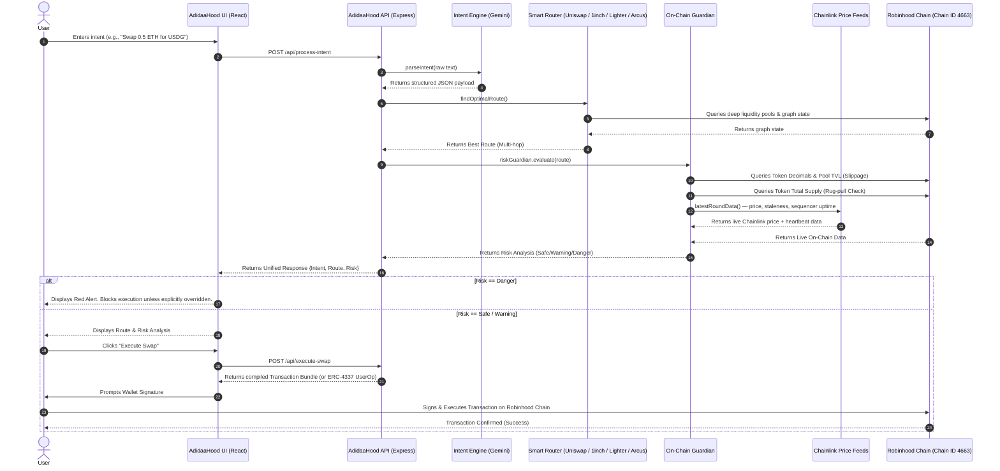
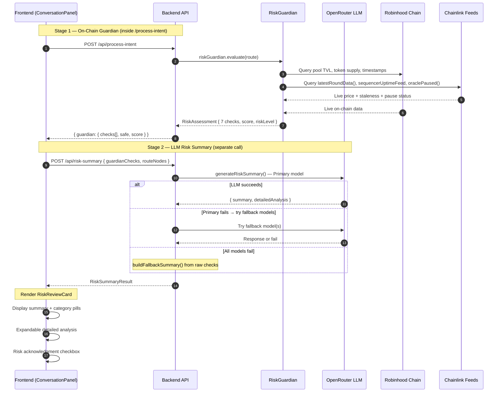

# 🧠 AdidaaHood: AI-Powered Intent Execution Protocol

-00C805?style=for-the-badge&logo=chainlink)


**AdidaaHood** is a next-generation AI-orchestrated liquidity intelligence and execution layer built for **Robinhood Chain**, the Arbitrum-based Layer 2 for tokenized real-world assets. It allows users to express their trading desires in natural language (e.g., *"Swap 0.5 ETH for the safest route into AAPL Stock Token"*), dynamically resolves the optimal route across the chain's DEX ecosystem, passes the transaction through our **On-Chain Risk Guardian** (backed by live Chainlink oracle data), and seamlessly outputs a secure transaction bundle ready for wallet signature — optionally gas-sponsored via account abstraction.

> ### 📝 Robinhood Chain Alignment Notes (v2.1)
> This revision corrects and aligns the previous draft with Robinhood Chain's actual network specification and developer stack:
> - **No native "RBN" token exists.** Robinhood Chain has no native chain token — gas is paid in **ETH**, and Stock Token settlement runs through **USDG** (a regulated stablecoin deployed natively on the chain). All example intents below have been corrected accordingly.
> - Added the real **network configuration** (Chain ID, RPC/WSS endpoints, block explorer).
> - Replaced the generic "live RPC price query" claim with the correct oracle source: **Chainlink `AggregatorV3Interface`** feeds (crypto + Stock Tokens), including the **L2 sequencer uptime check** and **corporate-action oracle pause** handling that Robinhood Chain requires.
> - Replaced the generic "Aggregator SDK" with the actual DEX/liquidity ecosystem live on Robinhood Chain (**Uniswap, 1inch, Lighter, Arcus**).
> - Added a section on **Account Abstraction (ERC-4337 + EIP-7702)**, powered by Alchemy (with ZeroDev/Privy/Dynamic as alternatives), which AdidaaHood uses for gasless/batched swap execution.
> - Added Stock Token–specific risk handling (24/5 market hours, `uiMultiplier()`, oracle pause during corporate actions).

---

## 🌐 0. Robinhood Chain Network Configuration

| Property | Mainnet | Testnet |
|---|---|---|
| Chain ID | `4663` | `46630` |
| Native Gas Token | ETH | ETH |
| Block Explorer | [robinhoodchain.blockscout.com](https://robinhoodchain.blockscout.com) | [explorer.testnet.chain.robinhood.com](https://explorer.testnet.chain.robinhood.com) |
| Recommended RPC (Alchemy) | `https://robinhood-mainnet.g.alchemy.com/v2/{API_KEY}` | `https://robinhood-testnet.g.alchemy.com/v2/{API_KEY}` |
| Recommended WSS (Alchemy) | `wss://robinhood-mainnet.g.alchemy.com/v2/{API_KEY}` | `wss://robinhood-testnet.g.alchemy.com/v2/{API_KEY}` |
| Public RPC (rate-limited, dev only) | `https://rpc.mainnet.chain.robinhood.com` | `https://rpc.testnet.chain.robinhood.com` |
| Testnet Faucet | — | `faucet.testnet.chain.robinhood.com` |

Robinhood Chain is an Arbitrum Layer-2 built on Ethereum, using Ethereum blobs for data availability. It is fully EVM-compatible — Solidity/Vyper contracts deploy unmodified, and standard tooling (Hardhat, Foundry, ethers.js, viem, Wagmi) works out of the box. QuickNode, Blockdaemon, dRPC, and Validation Cloud are also supported as alternative infra providers.

---

## 🌊 1. System Processing Flow

<p align="center">
  
</p>

The core architecture runs on a 4-step pipeline designed to securely transition abstract user intent into deterministic blockchain execution:

1.  **Intent Parsing Engine (Solver):**
    *   Users input natural language requests.
    *   The engine extracts quantitative parameters (Source Token, Destination Token, Amount) and qualitative constraints (e.g., Safest, Fastest, Max Output).
    *   Supported source/destination assets include native **ETH**, **USDG**, other bridged ERC-20s, and **Stock Tokens** (e.g. AAPL, NVDA — ERC-20s with an 18-decimal, Chainlink-priced representation of the underlying equity).
    *   *Output:* A normalized Intent Object.
2.  **Graph State Manager (In-Memory Persistence):**
    *   Maintains an ultra-low latency (`< 200ms` refresh) directed acyclic graph (DAG) of actively monitored liquidity pools across Robinhood Chain's DEX ecosystem — including **Uniswap**, **1inch**, **Lighter**, and **Arcus**.
    *   *Output:* Current liquidity depth, fee ratios, and token balances.
3.  **Smart Routing Engine:**
    *   Processes the structured intent against live graph states to discover the most efficient multi-hop swap routes across the integrated Robinhood Chain DEXs.
    *   *Output:* Optimal trade route (e.g., `ETH -> USDG -> AAPL Stock Token` with proportional splits) and expected output.
4.  **On-Chain Risk Guardian & Transaction Assembler:**
    *   Evaluates the route by querying live Robinhood Chain RPC nodes and **Chainlink price feeds** for dynamic price impact, stale liquidity, and token supply concentration.
    *   For Stock Token legs, additionally checks the Chainlink **L2 sequencer uptime feed** and the token's **`oraclePaused()`** flag (set during corporate actions like splits/dividends).
    *   Upon clearing the risk threshold (or receiving user override for flagged risks), the engine compiles a transaction bundle ready for wallet signature — optionally as a **gas-sponsored ERC-4337 UserOperation**.

### Non-Technical Overview: How AdidaaHood Works

<p align="center">
  
</p>

### Sequence Diagram: End-to-End Execution Flow



### Risk Review Flow

After the main pipeline produces a route and guardian assessment, a dedicated **Risk Review** stage generates human-readable risk analysis for the user:



**7 Guardian Risk Checks:**

| # | Check | Data Source | Category |
|---|---|---|---|
| 1 | Price Impact / Slippage | Route execution impact + fees | Slippage |
| 2 | Liquidity Risk (Trade Impact Ratio) | Pool TVL vs trade size | Slippage |
| 3 | Liquidity Depth / Fragmentation | Multi-hop pool analysis | Slippage |
| 4 | Pool Safety (Age & Activity) | Last TX timestamp on-chain | Pool Health |
| 5 | Token Safety (Whitelist + Verification) | Token registry + on-chain checks | Token Safety |
| 6 | Supply Concentration | Token supply vs pool depth | Concentration |
| 7 | Oracle Health (Chainlink) | `latestRoundData()` staleness, sequencer uptime, `oraclePaused()` | Token Safety |

**LLM Fallback Chain:**
`Primary Model → Fallback Model 1 → Fallback Model 2 → Raw Check Fallback (no LLM)`

The frontend `RiskReviewCard` displays:
- **Summary**: 3-5 sentence plain-English overview with highlighted risk keywords and numbers
- **Category Pills**: Slippage / Concentration / Pool Health / Token Safety — color-coded by worst check status
- **Expandable Details**: Structured breakdown grouped by the 4 categories
- **Acknowledgment Checkbox**: User must confirm understanding before executing


## 🧠 2. Core Technologies & Architecture

### A. Gemini-Powered Intent Parsing
AdidaaHood moves away from traditional drop-downs and manual configurations. We utilize **Google Gemini 2.5 Flash** (via OpenRouter) fine-tuned for domain-specific slot extraction. This NLP engine transforms conversational requests into structured, deterministic JSON payloads containing source tokens, destination tokens, trade amounts, and specific constraints in milliseconds.

### B. Smart Route Optimization (Robinhood Chain DEX Ecosystem)
AdidaaHood routes across the real liquidity venues live on Robinhood Chain rather than a single AMM — currently **Uniswap**, **1inch**, **Lighter**, and **Arcus** — to construct the most capital-efficient multi-hop swap routes, automatically splitting trades across pools and DEXs to minimize slippage and maximize output. Because ETH is the chain's only gas asset and there is no native "chain coin," routing always resolves against real settlement assets: ETH, USDG, bridged ERC-20s, and Stock Tokens.

### C. On-Chain Risk Guardian (Chainlink-Powered)
Before any transaction reaches the mempool, it must pass through our deterministic Risk Guardian Engine. The Guardian pulls live data directly from Robinhood Chain RPC nodes **and Chainlink `AggregatorV3Interface` price feeds** — the same oracle standard used for both crypto assets and Stock Tokens on Robinhood Chain — to evaluate:

#### 1. Price Impact & Slippage Risk
Evaluates the mathematical impact of your trade on the Automated Market Maker (AMM) curve. We dynamically calculate the effective price impact by taking the maximum between the simulated execution impact and the aggregate fee accumulation of the route:
  ```math
  \text{Effective Impact} = \max(\text{Simulated Impact}_\%, \sum (\text{Pool Fee}_\%) \times 0.5)
  ```
  *(If the effective impact is ≥ 5.0%, execution is blocked (DANGER) due to extreme value loss. If ≥ 2.5%, it issues a WARNING recommending trade splitting.)*

#### 2. Liquidity Health & Trade Impact Ratio (Mathematically Decoupled)
We strictly separate the absolute size of a pool from the relative impact of your specific trade:
- **Liquidity Health (Absolute TVL):** Evaluates the bottleneck (smallest) pool in the route. If the bottleneck pool holds < $10k TVL, the route is deemed highly dangerous and illiquid.
- **Liquidity Risk (Trade Impact Ratio):** Calculates your exact risk of slippage by measuring your trade volume against the available token depth in a 50/50 pool structure:
  ```math
  \text{Trade}_{\text{USD}} = \text{Trade Amount} \times \text{Token Price}_{\text{USD}}
  ```
  ```math
  \text{Impact Ratio} = \frac{\text{Trade}_{\text{USD}}}{(\text{Pool TVL} / 2)} \times 100\%
  ```
  *(If your Trade Impact Ratio exceeds 20% of the active token depth, the Guardian explicitly blocks execution to prevent being sandwiched or suffering extreme slippage.)*

#### 3. Dual-Layer Supply Concentration (Rug-Pull Check)
AdidaaHood uses a two-pronged approach to detect "rug-pulls" and scam tokens before you interact with them:

**Layer A: Minting Authority Verification**
The Guardian traces the Token contract on-chain to verify minting privileges.
- If the minting authority is currently held by an active owner address (the deployer), they possess infinite minting privileges. This triggers an immediate **DANGER** lock.
- If the minting authority is renounced or burned, the token supply is mathematically fixed.
- Stock Tokens are exempt from this check — supply changes are governed by the regulated issuer's corporate-action process, not an arbitrary owner key.

**Layer B: Pool Concentration Ratio**
Analyzes token distribution to detect hoarding by comparing the token amount actively locked in the liquidity pool versus the total circulating supply on-chain:
  ```math
  \text{Token Depth in Pool} = \frac{(\text{Pool TVL} / 2)}{\text{Token Price}_{\text{USD}}}
  ```
  ```math
  \text{Concentration Ratio} = \frac{\text{Token Depth in Pool}}{\text{Total Supply}} \times 100\%
  ```
  *(If < 0.05% of the total supply is in the pool, indicating 99.95%+ is held in developer wallets, the Guardian flags it as an Extreme Rug-Pull Risk.)*

#### 4. Token Freshness (Honeypot Check)
Newly created tokens are mathematically the highest risk vectors for malicious draining. The Guardian tracks the exact contract deployment timestamp on Robinhood Chain to verify the exact age of the token:
- **Age < 1 Day:** Extreme Risk (DANGER) - highly susceptible to pump-and-dump mechanics.
- **Age < 7 Days:** Elevated Risk (WARNING) - requires user caution.

#### 5. Oracle Health Check (Chainlink, Robinhood-Chain-specific)
Because Robinhood Chain is an L2, a healthy-looking price can still be unsafe to trust if the sequencer is down or a corporate action is mid-flight. Before accepting any Chainlink price, the Guardian:
- Checks `updatedAt` against the feed's heartbeat and **rejects stale prices**.
- Validates the answer is non-zero and positive.
- Reads `decimals()` dynamically rather than hardcoding scale.
- Queries the **Chainlink L2 Sequencer Uptime Feed** and requires the grace period to have elapsed since the sequencer came back up.
- For Stock Tokens specifically, checks `oraclePaused()` — set true while a dividend/split is being processed — and treats a paused oracle as "price temporarily unavailable" rather than stale-but-usable. Where relevant, applies `uiMultiplier()` to convert between token price and underlying share price.

**Deterministic Execution Thresholds:**
Based on the on-chain data, the Guardian makes discrete routing decisions:
*   **SAFE (Green Light):** The routing sequence is immediately passed to the transaction assembler.
*   **WARNING (Yellow Light):** Minor risks detected (e.g., slightly elevated slippage). Trade proceeds but with inline warnings.
*   **DANGER (Red Light):** Critical risks detected (e.g., massive price impact, extreme concentration, or a paused/stale oracle). Execution is explicitly blocked, requiring the user to manually acknowledge and override the safety block before signing.

### D. Account Abstraction & Gas Sponsorship (ERC-4337 + EIP-7702)
Robinhood Chain has first-class support for **ERC-4337** account abstraction and **EIP-7702** (letting an existing EOA delegate to smart-account logic without changing address). AdidaaHood uses this to let users execute swaps without holding ETH for gas:
- **Provider:** Alchemy (primary; deployed Entrypoint v0.6/0.7/0.8 + SenderCreator contracts on Robinhood Chain), with **ZeroDev**, **Privy**, or **Dynamic** available as alternative smart-account stacks.
- **Capabilities used:** gas sponsorship via a Gas Manager policy, batched calls (e.g., approve + swap in one UserOperation), and session keys for repeat/automated intents.
- **Bundler / RPC:** `https://robinhood-mainnet.g.alchemy.com/v2/{API_KEY}` on Chain ID `4663`.

### E. Backend Engine Upgrades (v2.1)

Our latest backend improvements bring a host of smart features to eliminate edge cases and guarantee seamless execution:
*   **Dynamic Amount & Gas Reserve:** Users can specify amounts using natural language like `"ALL"`, `"MAX"`, or percentages (e.g., `"Swap 50% of my balance"`). The system automatically reads the wallet's real-time balance and intelligently reserves a small amount of ETH for gas fees to prevent failed transactions (skipped entirely for gas-sponsored ERC-4337 flows).
*   **Smart Token Suggestion & Disambiguation:** If a token symbol is ambiguous (e.g., multiple tokens share the same symbol) or misspelled, the NLP engine automatically queries the on-chain registry and suggests verified, safe token alternatives instead of silently failing or picking the wrong asset.
*   **Alternative Funding Sources:** When a user lacks sufficient balance of the requested source token, the system scans their wallet for other valuable assets and proactively suggests an alternative swap route to fulfill the destination intent.
*   **Dynamic Slippage Calculation:** Slippage is no longer a fixed parameter. The system dynamically computes the optimal slippage tolerance by cross-referencing live liquidity depth, the specific USD size of the trade, price impact, and the number of hops in the route.
*   **Robust LLM Fallback Mechanism:** A resilient fallback layer for the Risk Advisor ensures that even if all LLM models (via OpenRouter) experience downtime, the system instantly constructs accurate, deterministic risk summaries directly from raw on-chain data.
*   **Stock Token Market-Hours Awareness (new in v2.1):** Because Stock Token oracles update 24/5 on market hours, the Guardian flags routes involving a Stock Token whose feed hasn't updated within the expected heartbeat window as `WARNING` rather than silently trusting a stale weekend/holiday price.

---

## 💻 3. Local Development Setup

Follow these steps to clone and run AdidaaHood locally.

### Prerequisites
*   **Node.js**: v18.0.0 or higher
*   **npm** or **yarn**
*   A compatible EVM wallet installed in your browser (or an Alchemy/ZeroDev API key for gasless flows).

### Installation

1. **Clone the repository** (or download the ZIP):
   ```bash
   git clone https://github.com/Tinacooking/AdidaaHood.git
   cd AdidaaHood
   ```

2. **Install dependencies**:
   ```bash
   npm install
   ```

3. **Environment Setup**:
   Copy the example environment variables and fill out API keys / RPC endpoints for Robinhood Chain.
   ```bash
   cp .env.example .env
   ```
   Edit `.env` with real Robinhood Chain values:
   ```bash
   # Robinhood Chain — mainnet
   CHAIN_ID=4663
   RPC_ENDPOINT=https://robinhood-mainnet.g.alchemy.com/v2/YOUR_ALCHEMY_API_KEY
   WSS_ENDPOINT=wss://robinhood-mainnet.g.alchemy.com/v2/YOUR_ALCHEMY_API_KEY
   BLOCK_EXPLORER=https://robinhoodchain.blockscout.com

   # Robinhood Chain — testnet (for local dev / CI)
   TESTNET_CHAIN_ID=46630
   TESTNET_RPC_ENDPOINT=https://robinhood-testnet.g.alchemy.com/v2/YOUR_ALCHEMY_API_KEY
   TESTNET_FAUCET=https://faucet.testnet.chain.robinhood.com

   # Account abstraction (optional, for gasless swaps)
   ALCHEMY_GAS_POLICY_ID=YOUR_GAS_MANAGER_POLICY_ID
   ```
   *If you don't have an Alchemy key yet, you can fall back to the public, rate-limited endpoint `https://rpc.mainnet.chain.robinhood.com` for development — not recommended for production.*

### Running the Application

This is a Full-Stack application containing both the React/Vite Frontend and the Express API Backend.

**Start the Development Server:**
```bash
npm run dev
```
> The development server will compile the backend on-the-fly and deploy Vite's HMR middleware. The application will be accessible at `http://localhost:3000`.

**Build for Production:**
Compile both the frontend SPA and bundle the backend TypeScript into a unified Node.js deployment.
```bash
npm run build
npm run start
```

---

## 🚀 4. Algorithm Processing & System Novelty

### The Intent Engine & Advanced Routing Integration
What fundamentally separates AdidaaHood from standard DEX aggregators is our **Intent Engine**, powered by a highly optimized integration of Google Gemini NLP and live routing across Robinhood Chain's DEX ecosystem (Uniswap, 1inch, Lighter, Arcus). Traditional swappers force users to understand liquidity fragmentation, hop paths, and route optimization. AdidaaHood flips this paradigm: users simply state their ultimate goal (their *intent*), and the engine independently handles the complexity under the hood — including routing into and out of **Stock Tokens**, which is unique to Robinhood Chain among EVM L2s.

Our team has fine-tuned this architecture to achieve unprecedented processing speeds. This optimization allows the Intent Engine to instantly parse natural language, compute multi-hop paths across Robinhood Chain, and synthesize the safest execution matrix in milliseconds.

### 🌐 Mass Adoption & Ecosystem Impact:
Our technological breakthroughs translate directly into ecosystem growth for Robinhood Chain:

- **Eradicating the UX Barrier for New Users:** DeFi is notoriously intimidating. By abstracting away complex parameters (slippage limits, pool comparisons, routing nodes, and even gas — via ERC-4337 sponsorship) into simple, conversational interactions, AdidaaHood creates the ultimate frictionless onboarding experience. A first-time user can trade with the sophistication of an institutional quant without writing a single line of technical parameter, and without needing to hold ETH just to pay gas.
- **Maximized Capital Efficiency:** By drastically reducing graph traversal time, our routing algorithm captures fleeting arbitrage opportunities and guarantees the best available exchange rates across the live DEX ecosystem before market states evolve, ensuring users extract maximum value.
- **Driving Deep Ecosystem Liquidity:** A seamless, zero-anxiety execution environment is the catalyst for retail and institutional adoption. By making Robinhood Chain the easiest blockchain to transact on, AdidaaHood serves as a liquidity magnet, ultimately increasing trading volume, TVL, and utilization across Uniswap, 1inch, Lighter, Arcus, and other integrated protocols in the ecosystem.

---

## ⚖️ 5. Competitive Landscape on Robinhood Chain

While the Robinhood Chain ecosystem boasts robust DeFi infrastructure, AdidaaHood introduces an entirely new paradigm—shifting from manual aggregation to AI-driven intent execution. Here is how AdidaaHood compares to existing products:

### 1. AdidaaHood vs. Traditional DEX Aggregators
*   **Traditional Aggregators:** Require the user to manually input specific tokens, select exact slippage limits, evaluate different routes, and construct the swap directly. The user bears the cognitive load of formulating the transaction.
*   **AdidaaHood (Intent Engine):** The user simply types *"Swap 1000 USDG for the safest route into NVDA Stock Token"*. AdidaaHood naturally parses this, uses the **Smart Router** to find the deepest path across Uniswap/1inch/Lighter/Arcus, runs the **On-Chain Risk Guardian** (with Chainlink oracle + sequencer-uptime validation) to ensure safety, and autonomously synthesizes the exact transaction bundle. **AdidaaHood moves aggregation to the background, elevating the user experience to pure intent.**

### 2. AdidaaHood vs. Standard Smart Routing Protocols
*   **Standard Routers:** Offer excellent routing and multi-asset pools, focusing on complex pathfinding. However, the interface remains fundamentally deterministic and manual—tailored for experienced DeFi users who understand pool weights.
*   **AdidaaHood (Intent Engine):** Not only matches the underlying multi-hop efficiency but adds a proactive **On-Chain Risk Guardian Engine** built specifically for Robinhood Chain's oracle and market-structure quirks (Chainlink staleness, L2 sequencer uptime, Stock Token oracle pauses during corporate actions). If a route relies on a pool experiencing sudden high slippage, toxic concentration, or an unreliable Stock Token feed, AdidaaHood dynamically halts execution before submission. Furthermore, AdidaaHood allows new users to execute these complex multi-hop trades effortlessly through natural language — with gas paid for them via ERC-4337 sponsorship if desired — completely removing the steep learning curve.

### Conclusion
AdidaaHood does not replace the DEXs and aggregators live on Robinhood Chain; it acts as an intelligent overlay across them. By abstracting away the mechanical execution into natural language and reinforcing it with institutional-grade, oracle-aware risk models, AdidaaHood aims to onboard the next wave of retail users to Robinhood Chain.

## 🔒 Security Notice
*This is a beta interface running on Robinhood Chain (Chain ID `4663`) endpoints. The transaction sending and execution features are real, not simulated state, and are connected to live RPC nodes. There is no native Robinhood Chain token ("RBN" or otherwise) — never sign a transaction related to an unofficial token claiming to be "the Robinhood Chain token."*
