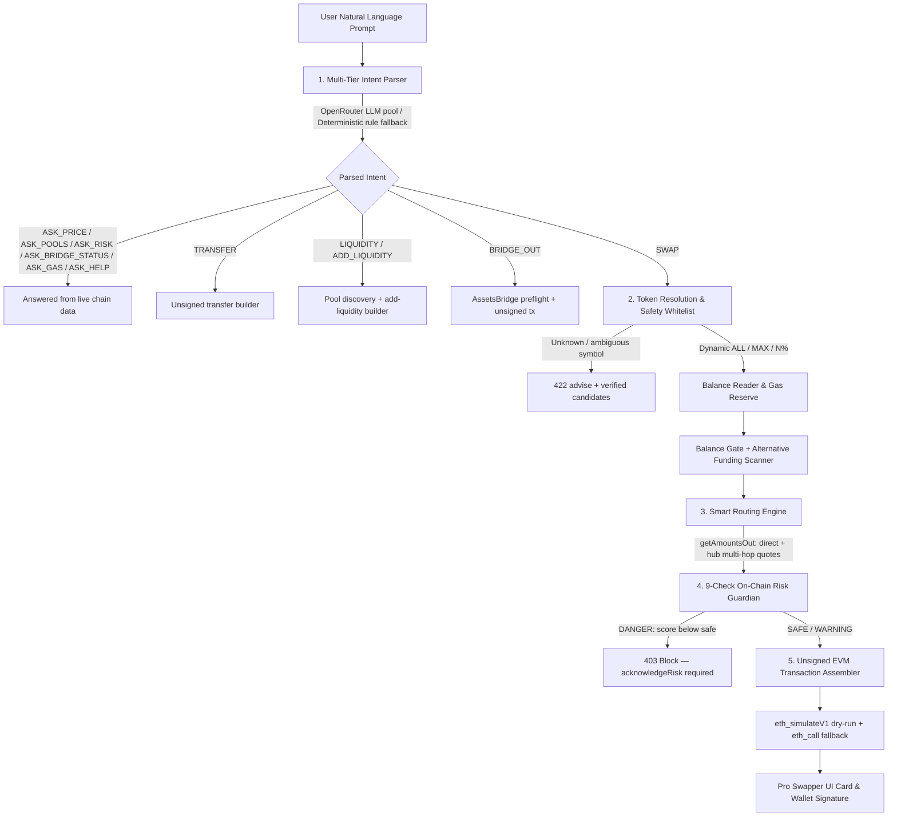

# 🧠 SOKA: AI-Powered Intent Execution Protocol

[](https://opensource.org/licenses/MIT)
[](https://react.dev/)
[](https://wagmi.sh/)
[](https://openrouter.ai/)
[](#)

**SOKA** is an AI-orchestrated intent execution protocol and liquidity routing engine on **Mezo Testnet** (Bitcoin L2 EVM, chain `31611`). Users express what they want in natural language (e.g. *"Swap 0.05 BTC for the safest route into MUSD"*, *"Trade 100 MUSD for BTC with the lowest slippage"*, *"Trade ALL BTC for MUSD"*, or *"Bridge 0.1 wBTC to Ethereum 0x…"*). SOKA's **Multi-Tier Intent Engine** parses the intent into a structured on-chain order, dispatches it to a dedicated executor (Swap, Bridge-Out, Transfer, Liquidity, or a live-data answer), searches optimal liquidity paths across Mezo Pools, runs every route through a **9-check On-Chain Risk Guardian**, and builds an unsigned EVM transaction ready for wallet signature — with zero manual slippage math, no token address hunting, and honest rejections (structured advise, never fabricated quotes) for anything outside system capabilities.

---

## 📑 Table of Contents

1. [System Architecture & Processing Pipeline](#-1-system-architecture--processing-pipeline)
2. [Multi-Tier AI Intent Engine](#-2-multi-tier-ai-intent-engine)
3. [Smart Routing & Liquidity Optimization](#-3-smart-routing--liquidity-optimization)
4. [9-Check On-Chain Risk Guardian](#-4-9-check-on-chain-risk-guardian)
5. [Dynamic Balances & Alternative Funding](#-5-dynamic-balances--alternative-funding)
6. [Bridge-Out & Transfers](#-6-bridge-out--transfers)
7. [Liquidity, Pools & Borrow Quotes](#-7-liquidity-pools--borrow-quotes)
8. [Pro Studio Interface](#-8-pro-studio-interface)
9. [API Reference](#-9-api-reference)
10. [Codebase & Directory Structure](#-10-codebase--directory-structure)
11. [Local Development & Setup](#-11-local-development--setup)
12. [License](#-12-license)

---

## 🌊 1. System Architecture & Processing Pipeline

SOKA executes user intents through an end-to-end pipeline orchestrated by `/api/process-intent`:



### The 5 Pipeline Stages:

1. **Multi-Tier Intent Parsing (LLM + Rule Fallback):**
   - Natural language is analyzed to extract quantitative fields (`trade_amount`, `source_token_symbol`, `destination_token_symbol`, `recipient`, `destination_chain`) and qualitative constraints (`SAFE`, `FAST`, `MAX_OUTPUT`, slippage tolerance, deadline, min output).
   - Supports shorthand values (`ALL`, `MAX`, percentages like `50%`, word amounts like `"half"`), multi-word coin names, and full contract addresses.
   - Chatter with no actionable content is rejected before any LLM call, so a hallucinating model can never turn *"hello there"* into a swap.

2. **Intent Dispatch & Token Resolution:**
   - Action type decides the executor: questions (`ASK_*`) are answered from live chain data; `TRANSFER`, `LIQUIDITY`, `BRIDGE_OUT`, and `SWAP` are routed to their dedicated builders — a question is never silently routed to a swap.
   - Symbols are evaluated against a curated whitelist (`BTC`, `wBTC`, `MEZO`, `MUSD`, `mUSDC`, `mUSDT`, `mDAI`, `mUSDe`, `mcbBTC`, `mFBTC`, `mSolvBTC`, `mswBTC`, `mT`) plus tokens discovered on-chain (`GET /api/tokens`).
   - If a symbol is ambiguous or non-whitelisted, SOKA rejects with verified candidates and runnable examples instead of guessing — never a fabricated pair.

3. **Smart Routing & Pathfinding:**
   - Retrieves real on-chain quotes from the Mezo Swap router (`getAmountsOut`) for direct pairs and multi-hop hub paths, and enriches the winning route with live pool address, reserves, TVL, and fee tier.
   - Slippage is converted to basis-points minimums, and a gas reserve is deducted when swapping the full native BTC balance.

4. **9-Check On-Chain Risk Guardian:**
   - Queries live on-chain state: price impact, pool liquidity, route depth, factory pool registration (all hops), token bytecode, pool share of total supply, trade-size-vs-liquidity, router-vs-oracle deviation, bridge/tx lockdown flags, and gas.
   - Computes a mathematical risk score (0–100) and discrete health levels (`SAFE`, `WARNING`, `DANGER`). Unsafe quotes return `403` and require an explicit `acknowledgeRisk` override.

5. **Unsigned Transaction Assembly & Simulation:**
   - Builds unsigned EVM calldata (approve + swap / bridge / transfer / liquidity) with slippage-protected minimums and deadlines. The backend never holds keys and never broadcasts.
   - Dry-runs the call chain via `eth_simulateV1` (chained state, approve → action) with a per-call `eth_call` fallback, and reports honest results (`success: true/false`, `simulated: true/false`) instead of assumed success.
   - Without a connected wallet the same pipeline returns a **quote preview** (`ptb: null`, `quoteOnly` advice) instead of a doomed transaction.

---

## 🧠 2. Multi-Tier AI Intent Engine

SOKA features a fail-safe, 2-tier parsing architecture that guarantees zero service disruption:

| Tier | Engine | Implementation | When Used |
|---|---|---|---|
| **Tier 1** | **OpenRouter LLM Pool** | Native `fetch` REST client with multi-model fallback chain | Primary parser when `OPENROUTER_API_KEY` is configured. Falls through on timeouts, HTTP errors, or invalid JSON. |
| **Tier 2** | **Deterministic Rule Parser** | Offline RegEx & semantic extraction (English + Vietnamese verbs) | Always available. Guarantees 100% uptime with zero external dependencies. |

The parser is **capability-aware**: its system prompt is generated from the live token whitelist and the capability registry, so what SOKA advertises and what it parses can never drift apart. When neither tier yields a usable intent, the API returns `422` with a structured `advise` payload (message + missing fields + runnable examples) — never a fabricated swap.

### Executable Capabilities

| Action | Status | Description |
|---|---|---|
| `SWAP` | executable | Token swaps on Mezo Swap with live quotes and guardian scoring |
| `BRIDGE_OUT` | executable | Bridge assets out to Ethereum or Bitcoin via the AssetsBridge precompile |
| `ADD_LIQUIDITY` | executable | Quote and supply liquidity to a live factory pool |
| `REMOVE_LIQUIDITY` | executable | Quote and withdraw liquidity (burn LP tokens) |
| `TRANSFER` | executable | Unsigned native / ERC-20 transfer for wallet signature |
| `BORROW` | advisory | Read-only borrow quotes (max borrow, LTV, liquidation price, APR) |
| `ASK_PRICE` · `ASK_POOLS` · `ASK_RISK` · `ASK_BRIDGE_STATUS` · `ASK_GAS` · `ASK_HELP` | executable | Conversational answers from live chain data |
| `INCENTIVE` · `DEPOSIT` | unsupported | Rejected with an explanation and a runnable alternative |

The same registry is exposed at `GET /api/capabilities` and powers frontend menus, quick prompts, and fallback advises.

### Example Prompts Understood:
- *"Swap 0.05 BTC to MUSD, safest route"* → Amount: `0.05`, Source: `BTC`, Dest: `MUSD`, Priority: `SAFE`
- *"Trade 100 MUSD for BTC with the lowest slippage"* → Amount: `100`, Source: `MUSD`, Dest: `BTC`, Priority: `MAX_OUTPUT`
- *"Trade ALL BTC for MUSD with 0.5% slippage"* → Amount: `ALL`, Source: `BTC`, Dest: `MUSD`, Constraint: `slippage: 0.5%`
- *"Sell half of my mUSDC into BTC"* → Amount: `50%`, Source: `mUSDC`, Dest: `BTC`
- *"Bridge 0.1 wBTC to Ethereum 0x…"* → Action: `BRIDGE_OUT`, chain: Ethereum
- *"Send 10 MUSD to 0x…"* → Action: `TRANSFER` with EVM recipient
- *"Show MUSD pools"* / *"What is the price of BTC?"* / *"Is it safe to trade right now?"* → Action: `ASK_*`

---

## ⚡ 3. Smart Routing & Liquidity Optimization

SOKA routes on **Mezo Pools** (Tigris Aerodrome fork on Mezo Testnet) with real on-chain quotes (`getAmountsOut` — no synthetic pricing):

- **Direct + Multi-Hop Traversal:** Every request builds candidate paths — direct volatile, direct stable, and 2-hop routes through intermediate hubs (`wBTC`, `mUSDC`, `mUSDT`, auto-discovered `MUSD`). The candidate with the highest on-chain output wins.
- **Fail-Loud Quoting:** If no candidate returns a non-zero quote, the router throws `NO_LIQUIDITY` and the API returns a `422` advise with a suggested hub pair — never an invented route.
- **Live Route Enrichment:** The winning path is resolved against the factory (`getPool`) for its real pool address, `getReserves` valued through the PriceOracle, and the pool fee tier converted from basis points. Unreadable values stay `null` instead of being estimated.
- **Slippage Protection:** Minimum outputs and liquidity minimums are derived from the user slippage tolerance with integer basis-points math; approvals are only included when the current allowance is insufficient (with a 10× amount buffer), and every transaction carries a deadline.
- **Gas Reserve Deduction:** When swapping the native gas asset (`BTC`) using `"ALL"` or `"MAX"`, SOKA automatically reserves `GAS_RESERVE_BTC` (default `0.0005 BTC`) for transaction fees, preventing out-of-gas failures.

---

## 🛡️ 4. 9-Check On-Chain Risk Guardian

Before any transaction can be signed, SOKA's deterministic **Risk Guardian** evaluates live on-chain parameters. Unverifiable data is reported honestly (as `WARNING`/unknown) rather than assumed safe:

```
┌──────────────────────────────────────────────────────────────────────┐
│                      ON-CHAIN RISK GUARDIAN                          │
├──────────────────────────────────────────────────────────────────────┤
│ 1. Price Impact            │ Execution impact vs warn/reject bands   │
│ 2. Pool Liquidity          │ Pool TVL vs minimum depth               │
│ 3. Liquidity Depth         │ Route hops vs recommended max           │
│ 4. Pool Safety             │ DEX check + factory registration        │
│ 5. Token Safety            │ Whitelist + bytecode (source & dest)    │
│ 6. Supply Concentration    │ Pool liquidity vs on-chain supply       │
│ 7. Trade Size vs Liquidity │ THIS trade vs pool depth                │
│ 8. Oracle Deviation        │ Router-implied vs oracle value          │
│ 9. Chain State             │ Bridge/tx lockdown flags + gas          │
└──────────────────────────────────────────────────────────────────────┘
```

| # | Check | What it measures | Default thresholds |
|---|---|---|---|
| 1 | **Price Impact** | Execution impact for the route | `WARNING ≥ 1.0%`, `DANGER ≥ 5.0%`; non-computable impact is reported as WARNING, never assumed zero |
| 2 | **Pool Liquidity** | Pool TVL against the minimum supported depth | `< $10,000` WARNING, `< $5,000` DANGER (volatile pair minimum × 0.5) |
| 3 | **Liquidity Depth** | Number of hops in the winning route | `> 3 hops` WARNING |
| 4 | **Pool Safety** | Mezo Swap DEX verification, liquidity health, and factory `isPool` registration for every unique hop (fail-closed) | Unregistered / unreadable pool → WARNING |
| 5 | **Token Safety** | Whitelist verification plus on-chain bytecode inspection for source and destination | No-code address → DANGER; bytecode present but unwhitelisted → WARNING; RPC failure → WARNING |
| 6 | **Supply Concentration** | Pool liquidity as a share of on-chain total supply (`totalSupply × oracle price`) | `≥ 50%` WARNING, `≥ 80%` DANGER; unverifiable inputs (e.g. native BTC) → WARNING |
| 7 | **Trade Size vs Liquidity** | USD value of THIS trade against pool liquidity (size-aware) | `≥ 5%` WARNING, `≥ 20%` DANGER |
| 8 | **Oracle Deviation** | Router-implied output value cross-checked against oracle-implied value | `≥ 5%` WARNING, `≥ 15%` DANGER |
| 9 | **Chain State** | Maintenance-precompile bridge/tx lockdown flags and live gas price | Tx lockdown → DANGER; elevated gas (`> 50 gwei`) → WARNING |

### Scoring

```
Score = 100 − (25 × DANGER checks) − (10 × WARNING checks)        clamped to 0–100
LOW ≥ 80   ·   MEDIUM ≥ 60   ·   HIGH ≥ 30   ·   CRITICAL < 30
Safe  = no DANGER check AND score ≥ 30
```

- Every check returns a human-readable message plus on-chain **references** (pool, token, oracle, or account addresses) that the UI links to the Mezo Explorer.
- An unsafe assessment blocks execution with `403` unless the caller explicitly passes `acknowledgeRisk: true` after reviewing each WARNING/DANGER.
- All thresholds, score deductions, and level boundaries are operator-tunable via environment variables (`RISK_PRICE_IMPACT_WARN`, `RISK_MIN_LIQUIDITY_VOLATILE`, `RISK_LIQ_IMPACT_DANGER`, `RISK_MIN_SAFE_SCORE`, `GAS_WARN_GWEI`, and more — see `.env.example`).

---

## 💰 5. Dynamic Balances & Alternative Funding

- **Dynamic Quantities (`ALL`, `MAX`, `%`):** Automatically reads connected wallet balances directly via RPC, converts units according to token decimal precision, floors to 6 decimals so rounding can never exceed the real balance, and reserves gas for native BTC swaps.
- **Balance Gate:** If the wallet cannot cover the requested amount, the pipeline rejects with `422` instead of producing a doomed quote, and includes a **one-click alternative route**:
  > *"Wallet holds 0.001 BTC but the swap needs 0.05 BTC. Fund it with one of these held tokens instead: 150 MUSD (~$150.00)."*
- **Alternative Funding Scanner:** Scans the wallet's other holdings for tokens with sufficient USD value (price from the on-chain PriceOracle; unknown prices are never estimated), ranks them by value, and returns suggested amounts capped at the actual balance.
- **Balance & Valuation API:** `POST /api/balance` returns formatted balances with optional `usdValue` and `priceSource` for a single symbol or every whitelisted token.

---

## 🌉 6. Bridge-Out & Transfers

### Bridge-Out (`BRIDGE_OUT`)

Move assets out of Mezo through the **AssetsBridge precompile** (`0x7b7c…0012`):

- **Destination chains:** `0` = Ethereum, `1` = Bitcoin. Ethereum recipients must be valid EVM addresses; Bitcoin recipients are accepted as BTC addresses and encoded on-chain.
- **Fail-Closed Preflight:** Outflow capacity and minimum amount are read live from the precompile; the amount is validated against both. If either cannot be read, the build is blocked rather than assuming a value. The service also enforces Bitcoin dust minimums (`0.01 BTC`).
- **Unsigned Transaction:** The builder returns the approve step (only when the allowance is insufficient) plus the unsigned `bridgeOut` call for wallet signature, dry-run through `eth_simulateV1`.
- **Live Status (`ASK_BRIDGE_STATUS`)**: Users can ask *"What is the bridge status?"* to get enabled chains, outflow capacities, and minimums without building a transaction.

### Transfers (`TRANSFER`)

- Builds an unsigned native BTC value transfer or an ERC-20 `transfer` call for any whitelisted token.
- Recipients must be EVM addresses (`0x` + 40 hex characters); the pipeline rejects anything else with a `422` advise. No approvals and no swap slippage — a transfer is a transfer, never silently rerouted.
- Simulated before signing and returned with the same `ptb` / `txSteps` shape as swaps.

---

## 🏊 7. Liquidity, Pools & Borrow Quotes

### Pool Discovery

`GET /api/pools` enumerates real pairs from the Mezo Swap factory (`allPoolsLength` / `allPools`), with a 30-second cache and a bounded scan window:

- Live reserves, TVL (valued through the PriceOracle), fee tier in percent, and stable/volatile classification from the factory.
- When a wallet is provided: LP token balance and pool share.
- `GET /api/pools/:address` verifies factory registration before returning detail for a single pool.

### Add / Remove Liquidity

- **Add:** the paired leg is computed from live reserves (`quote-paired`) so users never guess the second amount. The builder requests the router's optimal amounts, falls back to desired amounts, includes approvals per leg only when needed, and returns an unsigned `addLiquidity` with slippage floor and deadline.
- **Remove:** `quote-remove` previews both legs at live reserves; the execution builder approves the LP token and returns an unsigned `removeLiquidity` with a slippage-protected minimum.
- Adding liquidity can also be requested by intent: *"Add 0.001 BTC and 50 MUSD liquidity"* or *"Show MUSD pools"* (which returns ranked pool recommendations plus capital-efficiency advice).

### Borrow Quotes (Advisory)

- `POST /api/borrow-quote` returns max borrow, collateral value, max LTV, APR, and liquidation price from real balances and on-chain prices.
- `POST /api/borrow-reverse-quote` computes the exact collateral required for a desired debt amount and rejects with an advise when the wallet cannot cover it.
- Borrowing is quoted, not executed by SOKA — the UI directs users to the Mezo Portal for on-chain execution.

### Yield & Pool Advisor (`ASK_POOLS`)

*"Where should I add liquidity with the lowest fee?"* ranks token-matching pools by TVL or lowest fee, returns the top options with live TVL/fee data, and appends borrow options — synthesized by the LLM with a deterministic fallback summary.

---

## 🎨 8. Pro Studio Interface

The SOKA frontend is a React 19 + Vite 8 + Tailwind CSS v4 SPA with wagmi/viem wallet integration and RainbowKit:

### Landing (`/`)
- **Editorial Stacking Cards Deck:** A seven-act scroll narrative (Prologue, Shift, Journey, Creed, Proof, Architecture, Horizon) introducing the protocol philosophy, technical pillars, and execution terminal.
- **Generative Ink Background:** GPU-accelerated canvas rendering fluid watercolor plumes with cursor bloom and scroll parallax — no external asset bloat.

### Terminal (`/app`)
- **Chat-Style Intent Console:** Natural language composer with quick prompts, instant auto-suggestions, a multi-stage processing stepper (parse → on-chain scan → guardian), and conversational answers for `ASK_*` intents.
- **Four Action Modes:** Swap, Pool, Bridge, and Transfer — each with its own guided form, quote preview, and unsigned-transaction signature flow. Send/transfer, deposit, and withdraw shortcuts are available from the action menu.
- **Interactive Route Visualizer:** Displays multi-hop path splits, pool addresses, fee tiers, live liquidity depth, price impact, and optimal slippage.
- **Guardian Radar:** Real-time visualization of every on-chain safety check with score bands, category pills, expandable audit details, and explorer-linked references.
- **Swap History & Replay:** Persistent session history (localStorage, 12 entries) with explorer links, execution status (`SIMULATED` / `CONFIRMED` / `FAILED`), dry-run details, one-click re-run, and per-entry deletion.
- **Wallet Menu:** Live balances per token with USD valuation from on-chain prices, hide-balance preference, refresh, and disconnect.
- **Gas Pill & Market Widgets:** Header shows live gas with an elevated-price warning; an opt-in market sidebar (`VITE_ENABLE_MARKET=true`) adds top movers, trending, and newly listed panels with an SVG price chart modal.
- **Safety Acknowledgements:** Guardian warnings must be explicitly acknowledged before the Execute button unlocks; vault/pool supply flows require a deposit-terms checkbox; every signed transaction waits for a receipt and links to the Mezo Explorer.

---

## 🔌 9. API Reference

All endpoints accept and return JSON. The API includes strict Zod schema validation, per-IP rate limiting (60 requests/minute by default), and structured error responses.

**Error model**

| Status | Meaning |
|---|---|
| `400` | Validation failed — `details: [{ field, message }]`, `validation_status: 'INVALID_FORMAT'` |
| `403` | Guardian blocked execution — review warnings and retry with `acknowledgeRisk: true` |
| `422` | Unclear intent, unknown token, insufficient balance, or no liquidity — response carries `advise` (message, missing fields, runnable examples) and optional `tokenSuggestion` / `alternativeSource` |
| `429` | Rate limit exceeded — `retryAfter` seconds plus `X-RateLimit-*` headers |
| `500` | Server error — sanitized in production |

### Pipeline

#### `POST /api/process-intent`
The primary unified pipeline endpoint: parse → resolve → quote → guardian → unsigned tx (or `answer`).

```json
// Request
{
  "prompt": "Swap 0.05 BTC to MUSD, safest route",
  "senderAddress": "0x1234...5678",
  "slippage": 0.5,
  "acknowledgeRisk": false
}

// Response (swap)
{
  "intent": {
    "action_type": "SWAP",
    "trade_amount": "0.05",
    "source_token_symbol": "BTC",
    "source_token_address": "0x...",
    "destination_token_symbol": "MUSD",
    "destination_token_address": "0x...",
    "priority_mode": "SAFE"
  },
  "route": { "...": "live quotes, nodes, expected/min output" },
  "guardian": { "safe": true, "score": 95, "riskLevel": "LOW", "checks": [] },
  "requiresAcknowledgement": false,
  "advise": null,
  "ptb": { "...": "unsigned approve + swap steps" }
}
```

Response branches by action type: `answer` for `ASK_*`, `transfer`, `liquidity`, and `bridge` payloads for their intents. Unknown, ambiguous, or unsafe intents return `422`/`403` with structured `advise` (message + missing fields + runnable examples) instead of fabricated quotes.

#### `POST /api/parse-intent`
Direct natural-language parser endpoint.
```json
// Request
{ "prompt": "Trade 100 mUSDC to BTC" }

// Response
{
  "intent": { "...": "structured intent" },
  "confidence_score": 0.95,
  "validation_status": "VALID"
}
```
Unparseable prompts throw `422` with `advise` (never a fallback swap).

#### `POST /api/calculate-optimal-route`
Finds the optimal liquidity route for given token addresses and amount (real `getAmountsOut` quotes; `NO_LIQUIDITY` when pools are dry).

#### `POST /api/evaluate-guardian-risk`
Evaluates the 9 on-chain safety checks for an assembled route. Requires a real `amount` (no assumed size).

#### `POST /api/risk-summary` · `POST /api/risk-advice`
Generates human-readable risk summaries and guidance from raw guardian checks using the LLM (deterministic fallback included).

### Execution Builders

#### `POST /api/execute-swap`
Builds an unsigned EVM swap transaction from a fresh on-chain quote (backend never signs). Blocked `403` by the guardian unless `acknowledgeRisk` is passed.

#### `POST /api/bridge-out`
Builds an unsigned `bridgeOut` transaction for the AssetsBridge precompile, including preflight capacity/minimum validation.

#### `POST /api/transfer`
Builds an unsigned native or ERC-20 transfer (EVM recipients only).

#### `POST /api/balance`
Retrieves formatted on-chain token balances for an address, with optional USD valuation.

### Bridge

#### `GET` / `POST /api/bridge-info`
Returns enabled destination chains, token mappings, live outflow capacities, and minimum bridge-out amounts.

### Market Data

#### `GET /api/prices?symbols=BTC,MUSD`
Real USD prices from the PriceOracle precompile plus router quotes. Unknown prices resolve to `null` (never estimated).

#### `GET /api/pools?limit=20&offset=0&wallet=0x…` · `GET /api/pools/:address`
Factory-enumerated pools with live reserves, TVL, fee tier, stable/volatile classification, and optional LP position data.

### Liquidity

#### `POST /api/pools/quote-liquidity` · `POST /api/pools/quote-remove`
Read-only add/remove previews at live reserves.

#### `POST /api/pools/quote-paired`
Reserve-proportional paired leg: input one side, get the exact matching other side at live reserves (replaces 1:1 guessing across decimals/prices).

#### `POST /api/pools/add-liquidity` · `POST /api/pools/remove-liquidity`
Build unsigned `addLiquidity` / `removeLiquidity` calldata with approvals, slippage floors, and deadlines.

### Borrow (Advisory)

#### `POST /api/borrow-quote` · `POST /api/borrow-reverse-quote`
Read-only borrow previews from real balances and on-chain prices. `borrow-reverse-quote` returns `422` with an advise when collateral is insufficient.

#### `POST /api/borrow-execute`
Builds the execution payload shape for the borrow flow (execution itself is directed to the Mezo Portal).

### Meta & Utility

#### `GET /api/capabilities`
The capability registry: executable, advisory, and unsupported actions with requires-lists and runnable examples.

#### `GET /api/tokens`
Supported token list: static whitelist plus on-chain discovered tokens (e.g. MUSD).

#### `GET /api/gas-price`
Live network gas price with the operator warning threshold and an `elevated` flag.

#### `POST /api/mezo-rpc`
Safe read-only JSON-RPC proxy for Mezo Testnet with an allowlist of read methods (`eth_call`, `eth_getCode`, `eth_simulateV1`, …). `eth_sendRawTransaction` is deliberately unavailable — users sign locally.

---

## 📂 10. Codebase & Directory Structure

```
├── .env.example                  # Environment template (all variables documented)
├── LICENSE                       # MIT License
├── README.md                     # Documentation
├── package.json                  # Dependencies & build/test scripts
├── server.ts                     # Express + Vite dev middleware / static prod host
├── vercel.json                   # Vercel rewrites (SPA + /api serverless function)
├── metadata.json                 # App metadata
│
├── api/
│   └── index.ts                  # Vercel serverless entry (Express app export)
│
├── backend/                      # Backend Service Core
│   └── src/
│       ├── abi/                  # Router, factory, pair, ERC-20, bridge, oracle ABIs
│       ├── api/
│       │   ├── routes.ts         # REST API routes & controllers
│       │   └── middleware.ts     # Zod validation, rate limiter, request logger
│       ├── config/
│       │   ├── index.ts          # Env, risk/tx/bridge/lending/market configs
│       │   ├── constant.ts       # Precompiles + core token whitelist
│       │   └── capabilities.ts   # Executable/advisory/unsupported registry
│       ├── services/
│       │   ├── bridge/
│       │   │   └── bridgeService.ts      # AssetsBridge preflight + unsigned tx
│       │   ├── coin/
│       │   │   ├── tokenResolver.ts      # Whitelist + on-chain discovery
│       │   │   ├── coinService.ts        # On-chain RPC balance reader
│       │   │   └── alternativeSource.ts  # Wallet funding scanner
│       │   ├── lending/
│       │   │   └── borrowService.ts      # Read-only borrow quotes
│       │   ├── llm/
│       │   │   ├── intentParser.ts       # OpenRouter + deterministic parser
│       │   │   ├── llmClient.ts          # Multi-model OpenRouter client
│       │   │   ├── riskAdvisor.ts        # Risk synthesis & summaries
│       │   │   ├── yieldAdvisor.ts       # Pool ranking & borrow options
│       │   │   ├── errorAdvisor.ts       # Friendly error explanations
│       │   │   └── tokenAdvisor.ts       # Fuzzy match & candidate advisor
│       │   ├── pools/
│       │   │   └── poolService.ts        # Factory discovery, quotes, add/remove tx
│       │   ├── prices/
│       │   │   └── priceService.ts       # PriceOracle + router-quote USD prices
│       │   ├── risk/
│       │   │   └── LiquidityRiskGuardian.ts  # 9-check risk engine
│       │   ├── router/
│       │   │   ├── mezoRouter.ts         # Mezo Pools route pathfinder
│       │   │   └── mezoTxBuilder.ts      # Unsigned EVM tx builder
│       │   ├── safety/
│       │   │   ├── PoolSafety.ts         # Factory verification (fail-closed)
│       │   │   └── TokenSafety.ts        # Whitelist + bytecode checks
│       │   ├── tokens/
│       │   │   └── musdDiscovery.ts      # MUSD auto-discovery from pool legs
│       │   └── transfer/
│       │       └── transferService.ts    # Unsigned transfer builder
│       ├── types/
│       │   └── index.ts          # Domain types + Zod request schemas
│       └── utils/
│           ├── logger.ts         # Winston structured logger
│           ├── mezoClient.ts     # RPC client singleton + eth_simulateV1
│           └── erc20Utils.ts     # ERC-20 reads + approve calldata
│
├── test/                         # Unit, integration, legacy & e2e suites
│   ├── unit.*.test.ts            # Parser, capabilities, config, validation
│   ├── integration.*.test.ts     # API, answers, on-chain, simulation
│   ├── e2e/                      # Swap & bridge flow tests
│   └── *.test.ts                 # Router, tx builder, guardian, resolver
│
└── src/                          # Frontend Application (React 19)
    ├── main.tsx                  # Root providers & boot error boundary
    ├── App.tsx                   # Route definitions (/, /app + legacy aliases)
    ├── config.ts                 # Frontend runtime config (VITE_* env)
    ├── constants.ts              # Offline token fallback list
    ├── wagmi-config.ts           # RainbowKit/wagmi chain & connector setup
    ├── mezo-chain.ts             # viem custom chain definition (31611)
    ├── storageKeys.ts            # localStorage key registry
    ├── BootErrorBoundary.tsx     # Friendly startup error screen
    ├── services/
    │   └── mezoApi.ts            # Typed API client (pipeline, market, pools)
    ├── types/
    │   └── shared.ts             # Shared frontend/backend response types
    └── components/pro/
        ├── ProLanding.tsx        # Editorial landing page
        ├── ProSwapper.tsx        # Intent terminal console
        ├── ProHeader.tsx         # Nav, gas pill, wallet connect
        ├── WalletMenu.tsx        # Balances dropdown & disconnect
        ├── ProRouteVisualizer.tsx# Visual route path graph
        ├── ProGuardianRadar.tsx  # Guardian score & audit radar
        ├── HistoryPanel.tsx      # Swap session history & replay
        ├── MarketSidebar.tsx     # Opt-in market widgets
        ├── CoinChartModal.tsx    # SVG price chart modal
        ├── GenerativeInkCanvas.tsx  # Fluid background canvas
        └── MeshDriftCanvas.tsx   # WebGL fallback background
```

---

## 💻 11. Local Development & Setup

### Prerequisites
- **Node.js**: v20.19+ or v22.12+ (required by Vite 8)
- **npm** (or **bun** / **yarn**)

### 1. Clone & Install
```bash
git clone https://github.com/quangduy24/Soka.git
cd Soka
npm install
```

### 2. Environment Configuration
Copy `.env.example` to `.env`:
```bash
cp .env.example .env
```

Minimum viable configuration:
```env
# AI Model Configuration (optional but recommended)
OPENROUTER_API_KEY=your_openrouter_api_key_here

# Network & RPC (Mezo Testnet)
MEZO_RPC_ENDPOINT=https://rpc.test.mezo.org
MEZO_CHAIN_ID=31611
LOG_LEVEL=info

# Frontend: public WalletConnect client ID (required — the app refuses to boot without it)
VITE_WALLETCONNECT_PROJECT_ID=your_walletconnect_project_id
```

> *Notes:*
> - SOKA includes a deterministic offline parser. If no AI key is set, intent parsing falls back to the internal rule engine automatically.
> - Frontend variables are read **statically at build time** — restart `npm run dev` after editing `.env`, then hard-refresh the browser.
> - Runnable quotes, risk thresholds, bridge behavior, and lending parameters are all tunable from this file; see the comments in `.env.example` for every option.

### 3. Run Development Server
```bash
npm run dev
```
The Express server launches with Vite in middleware mode at `http://localhost:3000` (frontend and API on the same origin).

### 4. Build for Production
```bash
npm run build
npm run start
```
`npm run build` bundles the SPA with Vite and the server with esbuild into `dist/`; `npm run start` serves both from `dist/server.mjs`.

### 5. Typecheck & Tests
```bash
npm run lint          # tsc --noEmit
npm run test          # alias for test:unit
npm run test:unit         # deterministic parser, capabilities, config, validation
npm run test:integration  # live API, answers, on-chain reads, simulation
npm run test:legacy       # classic router / tx-builder / guardian suites
npm run test:all          # unit + legacy + integration
```

### 6. Deploy to Vercel
The repository ships with a serverless entry (`api/index.ts`) and rewrites (`vercel.json`):
- `/api/*` is served by the Express app as a serverless function.
- All other routes fall through to the SPA `index.html`.
- Set the same environment variables in the Vercel project settings.

---

## 📄 12. License

This project is licensed under the **MIT License**. See the [LICENSE](LICENSE) file for complete details.
