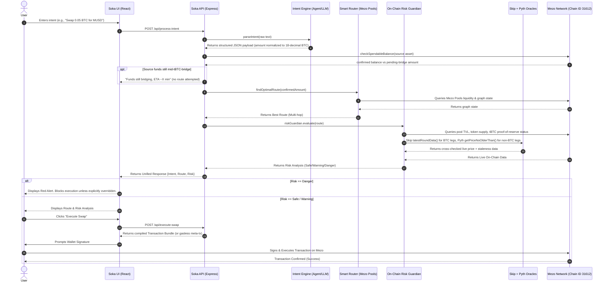

# 🧠 Soka: AI-Powered Bitcoin Intent Execution Protocol

-F7931A?style=for-the-badge&logo=bitcoin)


**Soka** is an AI-orchestrated intent execution layer built for **Mezo**, the Bitcoin-secured, EVM-compatible network for self-service Bitcoin banking. Users express what they want in natural language (e.g. *"Swap 0.05 BTC for the safest route into MUSD"*), Soka's **Intent Engine** turns that into a structured on-chain order, the **Smart Routing Engine** finds the most capital-efficient path across Mezo's liquidity, the transaction is checked by our **On-Chain Risk Guardian** (backed by Mezo's live oracle stack), and the result is a signed-ready transaction bundle — gasless when the user has no BTC on hand, since fees can be covered via Mezo's native meta-transaction relay.

> ### 📝 Mezo Integration Notes (v1.0)
> This revision replaces the previous draft, which described the backend intent/guardian core against a **Sui**-based deployment. Soka's execution core is now integrated against **Mezo**, and every network-specific claim below has been corrected to match Mezo's actual stack:
> - **No separate "SOKA" chain token.** Gas on Mezo is paid in **BTC** (18 decimals). Mezo does have its own native governance token, **MEZO**, plus the protocol's BTC-backed stablecoin, **MUSD** — neither is a Soka-issued token, and Soka never expects users to hold or approve a token calling itself "the Soka token."
> - Added the real **network configuration** (Chain ID, RPC endpoints, block explorer) for Mezo Mainnet and Testnet.
> - Replaced the generic "on-chain price query" claim with Mezo's actual oracle stack: the **Skip oracle** (a native, Chainlink-compatible `AggregatorV3Interface` feed for BTC/USD) cross-checked against the **Pyth** oracle for broader asset coverage.
> - Replaced the placeholder DEX aggregator with the real liquidity venue live on Mezo: **Mezo Pools**, Mezo's native concentrated-liquidity AMM with an on-chain TWAP oracle and flash-loan support.
> - Replaced the ERC-4337/EIP-7702 account-abstraction claim with Mezo's actual gasless mechanism: **meta-transactions** (permit + relay), the same primitive behind Mezo's own "Get Gas" feature, which Soka uses to sponsor execution for users without BTC.
> - Added Bitcoin-specific risk handling: **tBTC bridge/deposit-latency awareness** and **BTC-collateralized asset checks** (MUSD mint/redeem health), since Soka's core assets originate from Bitcoin deposits rather than a generic bridged-token model.

---

## 🌐 0. Mezo Network Configuration

| Property | Mainnet | Testnet |
|---|---|---|
| Chain ID | `31612` | `31611` |
| Native Gas Token | BTC (18 decimals) | BTC (18 decimals) |
| Block Explorer | [explorer.mezo.org](https://explorer.mezo.org) | [explorer.test.mezo.org](https://explorer.test.mezo.org) |
| Recommended RPC (Boar) | `https://mezo-mainnet.boar.network` | — |
| Recommended RPC (Validation Cloud) | `https://mainnet.mezo.public.validationcloud.io` | — |
| Recommended RPC (Imperator) | `https://rpc_evm-mezo.imperator.co` | — |
| Public RPC (dev) | — | `https://rpc.test.mezo.org` |
| Public WSS (dev) | — | `wss://rpc-ws.test.mezo.org` |
| Add via Chainlist | [chainlist.org/chain/31612](https://chainlist.org/chain/31612) | [chainlist.org/chain/31611](https://chainlist.org/chain/31611) |

Mezo is a Bitcoin-secured, fully EVM-compatible blockchain — Solidity/Vyper contracts deploy unmodified, and standard tooling (Hardhat, Foundry, ethers.js, viem, Wagmi) works out of the box. Native Bitcoin enters the network through the **tBTC bridge**: a deposit typically clears on-chain confirmation, gets revealed to the bridge, is minted as tBTC on Ethereum, and is then bridged into a Mezo BTC balance — a process that usually completes in roughly 1.5 hours end-to-end. Soka treats this bridging latency as a first-class constraint for any intent that depends on a fresh BTC deposit landing on Mezo.

---

## 🌊 1. System Processing Flow

The core architecture runs on a 4-step pipeline designed to securely transition abstract user intent into deterministic on-chain execution:

1.  **Intent Parsing Engine (Solver):**
    *   Users input natural language requests — a single swap, a recurring order, or an agent-issued intent from an automated strategy.
    *   The engine extracts quantitative parameters (Source Asset, Destination Asset, Amount) and qualitative constraints (e.g., Safest, Fastest, Max Output).
    *   Supported source/destination assets include native **BTC**, **MUSD** (Mezo's BTC-backed stablecoin), **MEZO**, and other assets bridged onto Mezo (including tBTC-wrapped Bitcoin).
    *   **Amount normalization (BTC-native, not a generic ERC-20):** native BTC on Mezo is a *18-decimal* balance, not the 8-decimal satoshi convention Bitcoin itself uses. A user typing "0.05 BTC" or "5,000,000 sats" must be parsed against the correct source convention and re-based to Mezo's 18-decimal wei-equivalent before it ever reaches the router — this is a common source of off-by-10^10 bugs when a team ports intent-parsing logic from a generic EVM chain.
    *   *Output:* A normalized Intent Object, tagged with each source asset's **funding status** (`confirmed` vs `pending-bridge`, see step 2).
2.  **Graph State & Balance Manager (In-Memory Persistence):**
    *   Maintains a low-latency directed acyclic graph (DAG) of actively monitored **Mezo Pools** — Mezo's native concentrated-liquidity AMM — including per-tick liquidity depth and fee tiers.
    *   **Spendable-balance filter (Mezo-specific):** before any amount is handed to the router, the manager checks the user's wallet against *confirmed, already-bridged* balances only. A native BTC deposit mid-flight through tBTC (on-chain confirmation → bridge reveal → mint → bridge-to-Mezo, ~1.5h typical) is **not counted as spendable liquidity** — it is surfaced back to the Intent Engine as `pending`, which can prompt a "your funds are still bridging, ETA ~X min" response instead of a route that silently fails or gets flagged only after the fact.
    *   *Output:* Current liquidity depth, fee ratios, and *confirmed* token balances (pending balances tracked separately, never blended in).
3.  **Smart Routing Engine:**
    *   Processes the structured intent — using only confirmed balances from step 2 — against live graph state to discover the most efficient route across Mezo Pools, including multi-hop paths through MUSD or MEZO where a direct pair is thin.
    *   When the intent says `"ALL"` or `"MAX"` on the BTC leg specifically, the router first deducts a gas reserve in native BTC (Mezo's only gas asset) before computing the tradeable amount, since source asset and gas asset are the same unit here — unlike a chain where gas and the traded asset are unrelated.
    *   *Output:* Optimal trade route (e.g., `BTC -> MUSD` or `BTC -> MUSD -> MEZO` with proportional splits) and expected output.
4.  **On-Chain Risk Guardian & Transaction Assembler:**
    *   Evaluates the route by querying live Mezo RPC nodes and Mezo's oracle stack (**Skip** for BTC-denominated legs, **Pyth** for non-BTC legs, cross-checked where both cover the same pair) for dynamic price impact, stale liquidity, and supply concentration.
    *   Separately checks the **protocol-level health of the tBTC bridge** backing any pool leg that holds wrapped BTC (proof-of-reserve status) — a distinct signal from the user's own pending-deposit check in step 2, since a route can be perfectly fine even while a *specific user's* deposit is still bridging.
    *   Upon clearing the risk threshold (or receiving user override for flagged risks), the engine compiles a transaction bundle ready for wallet signature — sponsored via a **gasless meta-transaction** when the user's BTC balance is too low to pay gas directly.

### Sequence Diagram: End-to-End Execution Flow



### Risk Review Flow

After the main pipeline produces a route and guardian assessment, a dedicated **Risk Review** stage generates human-readable risk analysis for the user:


**8 Guardian Risk Checks (grew from 7 → 8 to split the two bridge-related signals apart):**

| # | Check | Data Source | Category |
|---|---|---|---|
| 1 | Price Impact / Slippage | Route execution impact + fees | Slippage |
| 2 | Liquidity Risk (Trade Impact Ratio) | Mezo Pools TVL vs trade size | Slippage |
| 3 | Liquidity Depth / Fragmentation | Multi-hop, concentrated-liquidity tick analysis | Slippage |
| 4 | Pool Safety (Age & Activity) | Last TX timestamp on-chain | Pool Health |
| 5 | Token Safety (Whitelist + Verification) | Token registry + on-chain checks; canonical assets (BTC, MUSD, MEZO, tBTC) are pre-whitelisted, third-party pool tokens go through full checks | Token Safety |
| 6 | Supply Concentration | Token supply vs pool depth (skipped for MUSD — see Layer A below) | Concentration |
| 7 | Oracle Health (Skip / Pyth, per-leg) | Staleness check, non-zero/positive answer; Skip is authoritative for BTC-denominated legs, Pyth for non-BTC legs, cross-checked where both apply | Token Safety |
| 8 | tBTC Bridge / Proof-of-Reserve Health | Live reserve status of the tBTC bridge backing wrapped-BTC pool legs — a *protocol-level* signal, distinct from a single user's own pending deposit (handled upstream at balance-check time, not here) | Pool Health |

**LLM Fallback Chain:**
`Primary Model → Fallback Model 1 → Fallback Model 2 → Raw Check Fallback (no LLM)`

The frontend `RiskReviewCard` displays:
- **Summary**: 3-5 sentence plain-English overview with highlighted risk keywords and numbers
- **Category Pills**: Slippage / Concentration / Pool Health / Token Safety — color-coded by worst check status
- **Expandable Details**: Structured breakdown grouped by the 4 categories
- **Acknowledgment Checkbox**: User must confirm understanding before executing

---

## 🧠 2. Core Technologies & Architecture

### A. Agent & Natural-Language Intent Parsing
Soka moves away from manual token pickers and slippage inputs. A fine-tuned NLP layer transforms conversational requests — whether typed by a person or issued by an automated agent — into structured, deterministic JSON payloads containing source assets, destination assets, trade amounts, and specific constraints. This is the same intent surface an autonomous agent can call directly: an agent can submit a structured intent (or natural-language instruction) and receive back a route, a risk assessment, and a transaction bundle, without needing to understand Mezo Pools' tick math or oracle internals itself.

### B. Smart Route Optimization (Mezo Pools)
Soka routes through **Mezo Pools**, Mezo's native concentrated-liquidity AMM, to construct the most capital-efficient path for a given intent — splitting trades across fee tiers and hopping through MUSD or MEZO when it improves the outcome. Because BTC is the chain's only gas asset, routing always resolves against Mezo's real settlement assets: BTC, MUSD, MEZO, and tBTC-backed representations of Bitcoin.

### C. On-Chain Risk Guardian (Skip + Pyth Powered)
Before any transaction reaches the mempool, it must pass through our deterministic Risk Guardian Engine. The Guardian pulls live data directly from Mezo RPC nodes **and Mezo's on-chain oracle stack**:

- **Skip oracle** — a native, Chainlink-compatible `AggregatorV3Interface` feed providing BTC/USD pricing.
- **Pyth oracle** — used as a cross-check and for broader asset coverage beyond BTC/USD, via `getPriceNoOlderThan()` with a built-in staleness window.

#### 1. Price Impact & Slippage Risk
Evaluates the mathematical impact of your trade on the AMM curve. We dynamically calculate the effective price impact by taking the maximum between the simulated execution impact and the aggregate fee accumulation of the route:
  ```math
  \text{Effective Impact} = \max(\text{Simulated Impact}_\%, \sum (\text{Pool Fee}_\%) \times 0.5)
  ```
  *(If the effective impact is ≥ 5.0%, execution is blocked (DANGER) due to extreme value loss. If ≥ 2.5%, it issues a WARNING recommending trade splitting.)*

#### 2. Liquidity Health & Trade Impact Ratio (Mathematically Decoupled)
We strictly separate the absolute size of a pool from the relative impact of your specific trade:
- **Liquidity Health (Absolute TVL):** Evaluates the bottleneck (smallest) pool in the route. If the bottleneck pool holds < $10k TVL, the route is deemed highly dangerous and illiquid.
- **Liquidity Risk (Trade Impact Ratio):** Calculates your exact risk of slippage by measuring your trade volume against the available token depth:
  ```math
  \text{Trade}_{\text{USD}} = \text{Trade Amount} \times \text{Token Price}_{\text{USD}}
  ```
  ```math
  \text{Impact Ratio} = \frac{\text{Trade}_{\text{USD}}}{(\text{Pool TVL} / 2)} \times 100\%
  ```
  *(If your Trade Impact Ratio exceeds 20% of the active token depth, the Guardian explicitly blocks execution to prevent being sandwiched or suffering extreme slippage.)*

#### 3. Dual-Layer Supply Concentration (Rug-Pull Check)
Soka uses a two-pronged approach to detect scam tokens and hoarding before you interact with them:

**Layer A: Minting Authority Verification**
The Guardian traces the token contract on-chain to verify minting privileges.
- If minting authority is currently held by an active owner address, they possess infinite minting privileges. This triggers an immediate **DANGER** lock.
- If minting authority is renounced or burned, the token supply is mathematically fixed.
- **MUSD is exempt from this check** — its supply changes are governed by the protocol's over-collateralized mint/redeem mechanics against BTC, not an arbitrary owner key.

**Layer B: Pool Concentration Ratio**
Analyzes token distribution to detect hoarding by comparing the token amount actively locked in the pool versus total circulating supply on-chain:
  ```math
  \text{Token Depth in Pool} = \frac{(\text{Pool TVL} / 2)}{\text{Token Price}_{\text{USD}}}
  ```
  ```math
  \text{Concentration Ratio} = \frac{\text{Token Depth in Pool}}{\text{Total Supply}} \times 100\%
  ```
  *(If < 0.05% of the total supply is in the pool, indicating 99.95%+ is held in developer wallets, the Guardian flags it as an Extreme Rug-Pull Risk.)*

#### 4. Token Freshness (Honeypot Check)
Newly created tokens are mathematically the highest risk vectors for malicious draining. Because **Mezo Pools are permissionless** — anyone can call `mint()` to create a new pool for an arbitrary token — this check still matters on Mezo, just not for the chain's own canonical assets:
- **BTC, MUSD, MEZO, and tBTC are exempt** — they're the protocol's own canonical assets, not arbitrary pool listings, so a deployment-age heuristic doesn't apply to them.
- For every other pool token, the Guardian tracks the exact contract deployment timestamp on Mezo:
  - **Age < 1 Day:** Extreme Risk (DANGER) — highly susceptible to pump-and-dump mechanics.
  - **Age < 7 Days:** Elevated Risk (WARNING) — requires user caution.

#### 5. Oracle Health (Per-Leg Skip / Pyth Routing)
Before accepting any oracle price, the Guardian first decides *which* oracle is authoritative for the leg in question, then validates it:
- **BTC-denominated leg** (e.g. BTC↔MUSD): **Skip** is authoritative. The Guardian checks `updatedAt` against the feed's heartbeat and **rejects stale prices**, and validates the answer is non-zero and positive, reading `decimals()` dynamically rather than hardcoding scale.
- **Non-BTC leg** (e.g. MUSD↔MEZO): **Pyth** is authoritative, via `getPriceNoOlderThan()` with its own staleness window.
- **Any leg both feeds cover:** the Guardian cross-checks Skip against Pyth and flags the route `WARNING` if the two sources deviate beyond a configured threshold — this is a genuine cross-source check, not a Skip-vs-nothing fallback.

This is deliberately kept separate from the tBTC **bridge/reserve health** check (Guardian check #8) and from the user's own pending-deposit check (done upstream in the Graph & Balance Manager, step 2 of the pipeline) — three different signals that a naive port from a generic EVM chain would otherwise collapse into one "is the bridge okay?" flag.

**Deterministic Execution Thresholds:**
Based on the on-chain data, the Guardian makes discrete routing decisions:
*   **SAFE (Green Light):** The routing sequence is immediately passed to the transaction assembler.
*   **WARNING (Yellow Light):** Minor risks detected (e.g., slightly elevated slippage, small oracle deviation). Trade proceeds but with inline warnings.
*   **DANGER (Red Light):** Critical risks detected (e.g., massive price impact, extreme concentration, or a stale/deviating oracle). Execution is explicitly blocked, requiring the user to manually acknowledge and override the safety block before signing.

### D. Gasless Execution via Meta-Transactions
Mezo pays gas exclusively in BTC, which is a real onboarding barrier for a first-time or agent-driven user who arrives holding only MUSD or MEZO. Soka sponsors execution using the same **meta-transaction** primitive behind Mezo's own "Get Gas" flow:
- **Permit:** the user signs an off-chain message granting a relay permission to spend the required amount of MUSD or MEZO — no gas fee for this signature.
- **Relay:** a backend relay service submits the transaction on the user's behalf and covers the BTC gas cost.
- **Execute:** the transaction executes on-chain; for a plain gas top-up this nets the user a small, fixed amount of BTC, and for a Soka-routed swap the relay instead submits the assembled route directly.
- This keeps onboarding "pure Bitcoin economy" — no separate faucet or off-chain gas card required — while letting a user or an agent with zero BTC still get a Soka intent executed.

### E. Backend Engine Upgrades (v1.0)

Our latest backend improvements bring a host of smart features to eliminate edge cases and guarantee seamless execution:
*   **Dynamic Amount & Gas Reserve:** Users can specify amounts using natural language like `"ALL"`, `"MAX"`, or percentages (e.g., `"Swap 50% of my BTC"`). The system reads the wallet's real-time *confirmed* balance, re-bases it from whatever unit the user typed (BTC, sats) into Mezo's native 18-decimal representation, and reserves a small amount of BTC for gas to prevent failed transactions (skipped entirely for gasless meta-transaction flows).
*   **Smart Token Suggestion & Disambiguation:** If an asset symbol is ambiguous or misspelled, the NLP engine queries the on-chain registry and suggests verified, safe alternatives instead of silently failing or picking the wrong asset.
*   **Alternative Funding Sources:** When a user lacks sufficient balance of the requested source asset, Soka scans their wallet for other valuable assets (including BTC still mid-bridge) and proactively suggests an alternative route to fulfill the destination intent.
*   **Dynamic Slippage Calculation:** Slippage is not a fixed parameter. Soka dynamically computes the optimal slippage tolerance by cross-referencing live Mezo Pools liquidity depth, the specific USD size of the trade, price impact, and the number of hops in the route.
*   **Robust LLM Fallback Mechanism:** A resilient fallback layer for the Risk Advisor ensures that even if all LLM models experience downtime, the system instantly constructs accurate, deterministic risk summaries directly from raw on-chain data.
*   **Bridge-Aware Funding Checks (new in v1.0):** Because a native BTC deposit can take up to ~1.5 hours (and rarely longer) to finish bridging through tBTC, the Graph & Balance Manager excludes not-yet-finalized deposits from spendable balance *before* a route is even attempted — the user gets an "ETA ~X min" response instead of a route that's silently built against unavailable funds and only rejected at the Guardian stage.
*   **Protocol-Level Bridge Reserve Check (new in v1.0):** Independently, the Guardian monitors tBTC's proof-of-reserve status as an ongoing pool-health signal (check #8) — this protects against a systemic bridge issue, and is unrelated to any single user's deposit timing.

---

## 💻 3. Local Development Setup

Follow these steps to clone and run Soka locally.

### Prerequisites
*   **Node.js**: v18.0.0 or higher
*   **npm** or **yarn**
*   A compatible EVM wallet installed in your browser (MetaMask, Brave Wallet, or similar).

### Installation

1. **Clone the repository** (or download the ZIP):
   ```bash
   git clone https://github.com/Tinacooking/Soka.git
   cd Soka
   ```

2. **Install dependencies**:
   ```bash
   npm install
   ```

3. **Environment Setup**:
   Copy the example environment variables and fill out API keys / RPC endpoints for Mezo.
   ```bash
   cp .env.example .env
   ```
   Edit `.env` with real Mezo values:
   ```bash
   # Mezo — mainnet
   CHAIN_ID=31612
   RPC_ENDPOINT=https://mezo-mainnet.boar.network
   BLOCK_EXPLORER=https://explorer.mezo.org

   # Mezo — testnet (for local dev / CI)
   TESTNET_CHAIN_ID=31611
   TESTNET_RPC_ENDPOINT=https://rpc.test.mezo.org
   TESTNET_WSS_ENDPOINT=wss://rpc-ws.test.mezo.org
   TESTNET_BLOCK_EXPLORER=https://explorer.test.mezo.org

   # Oracle contracts
   SKIP_ORACLE_ADDRESS=0x7b7c000000000000000000000000000000000015
   PYTH_ORACLE_ADDRESS=0x2880aB155794e7179c9eE2e38200202908C17B43
   ```
   *For higher rate limits in production, use a keyed provider (Boar, Validation Cloud, or Imperator) rather than the public testnet RPC.*

### Running the Application

This is a Full-Stack application containing both the React/Vite Frontend and the Express API Backend.

**Start the Development Server:**
```bash
npm run dev
```
> The development server will compile the backend on-the-fly and deploy Vite's HMR middleware. The application will be accessible at `http://localhost:3000`.

**Build for Production:**
Compile both the frontend SPA and bundle the backend TypeScript into a unified Node.js deployment.
```bash
npm run build
npm run start
```

---

## 🚀 4. Algorithm Processing & System Novelty

### The Intent Engine & Agent-Native Execution
What fundamentally separates Soka from a standard swap UI is its **Intent Engine**: a single natural-language (or structured-agent) entry point that handles routing complexity across Mezo Pools under the hood. Traditional swap interfaces force a user, or an automated agent, to understand liquidity fragmentation, hop paths, and route optimization. Soka flips this: a person or an agent states the goal, and the engine independently resolves it — including sourcing BTC that's still finishing its tBTC bridge, which is unique to a Bitcoin-collateralized network like Mezo.

### 🌐 Adoption & Ecosystem Impact
Soka's approach translates directly into ecosystem growth for Mezo:

- **Eradicating the UX Barrier for New Users:** Bitcoin DeFi is intimidating for a first-time user, and doubly so when gas can only be paid in BTC. By abstracting slippage limits, pool comparisons, routing nodes, and even gas (via gasless meta-transactions) into a conversational interaction, Soka creates a low-friction onboarding path — a new user can trade without holding BTC just to pay gas.
- **Agent-Ready by Design:** Because the same intent surface serves a human typing a sentence and an autonomous agent calling an API, Soka is a natural execution layer for automated Bitcoin strategies that need a safety-checked path before anything touches the mempool.
- **Driving Deep Ecosystem Liquidity:** A seamless, zero-anxiety execution environment is a catalyst for adoption. By making Mezo easier to transact on, Soka acts as a liquidity magnet for Mezo Pools, ultimately increasing trading volume, TVL, and utilization across the protocol.

---

## ⚖️ 5. Competitive Landscape on Mezo

### 1. Soka vs. Manual Swap Interfaces
*   **Manual Interfaces:** Require the user to manually pick source/destination assets, set slippage, and evaluate pool routes themselves. The user bears the cognitive load of formulating the transaction.
*   **Soka (Intent Engine):** The user (or an agent) simply expresses *"Swap 500 MUSD for the safest route into BTC"*. Soka parses this, uses the **Smart Router** to find the deepest path across Mezo Pools, runs the **On-Chain Risk Guardian** (Skip + Pyth cross-checked, tBTC bridge-aware) to ensure safety, and autonomously synthesizes the transaction bundle.

### 2. Soka vs. Standard Smart Routing
*   **Standard Routers:** Offer solid pathfinding but remain fundamentally manual — tailored for users who already understand pool mechanics.
*   **Soka:** Matches the underlying multi-hop efficiency and adds a proactive **On-Chain Risk Guardian** built for Mezo's Bitcoin-collateralized structure — cross-source oracle validation and bridge-latency awareness that a generic router doesn't model. If a route relies on a pool with sudden high slippage, toxic concentration, or a deviating oracle, Soka dynamically halts execution before submission — and lets a zero-BTC user execute the trade anyway via gasless meta-transactions.

### Conclusion
Soka does not replace Mezo Pools; it acts as an intelligent, safety-checked overlay on top of them. By abstracting mechanical execution into natural language and an agent-callable intent API, and reinforcing it with a Bitcoin-aware risk model, Soka aims to make Mezo's self-service Bitcoin banking accessible to both everyday users and automated agents.

## 🔒 Security Notice
*This is a beta interface running on Mezo (Chain ID `31612`) endpoints. Transaction sending and execution features are real, not simulated, and are connected to live RPC nodes. There is no "SOKA" chain token — gas is paid in **BTC**, and Mezo's own governance token is **MEZO**; Soka does not issue a token, and you should never sign a transaction related to an unofficial token claiming to be "the Soka token."*
