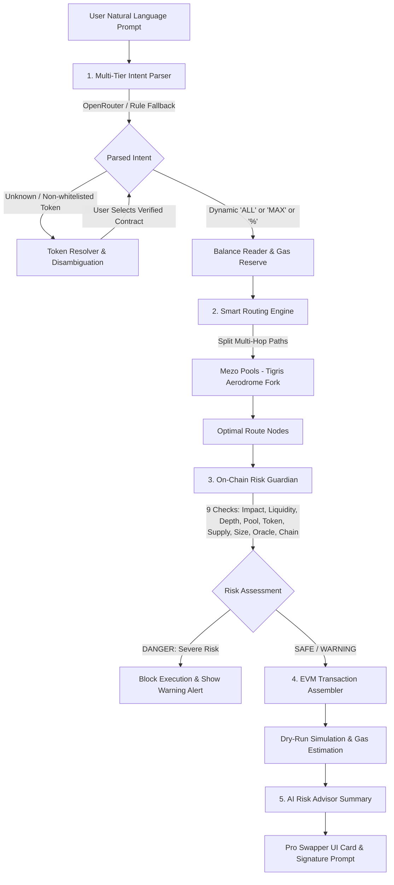

# 🧠 SOKA: AI-Powered Intent Execution Protocol

[](https://opensource.org/licenses/MIT)
[](https://react.dev/)
[](https://openrouter.ai/)
[](#)

<<<<<<< HEAD
**SOKA** is an AI-orchestrated intent execution protocol and liquidity routing engine on Mezo Testnet (Bitcoin L2 EVM). Users express what they want in natural language (e.g. *"Swap 0.05 BTC for the safest route into MUSD"*, *"Đổi 100 MUSD sang BTC trượt giá thấp nhất"*, or *"Trade ALL BTC for MUSD"*). SOKA's **Multi-Tier Intent Engine** parses the intent into a structured on-chain order, searches optimal liquidity paths across Mezo Pools, runs every route through a **9-check On-Chain Risk Guardian**, and builds an unsigned EVM transaction ready for wallet signature — with zero manual slippage math, no token address hunting, and honest rejections (structured advise, never fabricated quotes) for anything outside system capabilities.
=======
**SOKA** is an AI-orchestrated intent execution protocol and liquidity routing engine. Users express what they want to trade in natural language (e.g. *"Swap 0.05 BTC for the safest route into MUSD"*, *" swap 100 MUSD to BTC with a lowest slippage"*, or *"Swap 0.005BTC to mUSD"*). SOKA's **Multi-Tier Intent Engine** parses the intent into a structured on-chain order, searches optimal liquidity paths across concentrated AMMs, runs every route through a **7-Layer On-Chain Risk Guardian**, and synthesizes an atomic transaction block ready for signature — with zero manual slippage math, no token address hunting, and complete protection against sandwich attacks.
>>>>>>> a0cdd45ad898baab6c3e5275543bf20c261230d3

---

## 📑 Table of Contents

1. [System Architecture & Processing Pipeline](#-1-system-architecture--processing-pipeline)
2. [Multi-Tier AI Intent Engine](#-2-multi-tier-ai-intent-engine)
3. [Smart Routing & Liquidity Optimization](#-3-smart-routing--liquidity-optimization)
4. [7-Layer On-Chain Risk Guardian](#-4-7-layer-on-chain-risk-guardian)
5. [Dynamic Balances & Alternative Funding](#-5-dynamic-balances--alternative-funding)
6. [Pro Studio Interface](#-6-pro-studio-interface)
7. [API Reference](#-7-api-reference)
8. [Codebase & Directory Structure](#-8-codebase--directory-structure)
9. [Local Development & Setup](#-9-local-development--setup)
10. [License](#-10-license)

---

## 🌊 1. System Architecture & Processing Pipeline

SOKA executes trades through an end-to-end 5-stage pipeline orchestrated by `/api/process-intent`:



### The 5 Pipeline Stages:

1. **Multi-Tier Intent Parsing (LLM + Rule Fallback):**
   - Natural language is analyzed to extract quantitative fields (`trade_amount`, `source_token`, `destination_token`) and qualitative constraints (`SAFE`, `FAST`, `MAX_OUTPUT`, slippage tolerance).
   - Supports shorthand values (`ALL`, `MAX`, percentages like `50%`), multivariant coin names, and full contract addresses.

2. **Token Resolution & Safety Whitelist:**
   - Evaluates symbols against a curated core whitelist (`BTC`, `wBTC`, `MEZO`, `MUSD`, `mUSDC`, `mUSDT`, `mDAI`, `mUSDe`, `mcbBTC`, `mFBTC`, `mSolvBTC`, `mswBTC`, `mT`) plus on-chain discovered tokens (`GET /api/tokens`).
   - If a symbol is ambiguous or non-whitelisted, SOKA rejects with verified candidates and runnable examples instead of guessing — never a fabricated pair.

3. **Smart Routing & Pathfinding:**
   - Evaluates multi-hop split routes across liquidity pools (`byAmountIn`, up to 20 split paths, depth 3).
   - Optimizes execution price, fee tiers, and minimizes price impact.

4. **On-Chain Risk Guardian:**
   - Queries live on-chain state: pool TVL and reserves, factory registration (all hops), token bytecode, pool share of total supply, trade-size-vs-liquidity, router-vs-oracle deviation, bridge/tx lockdown flags, and gas.
   - Computes a mathematical risk score (0–100) and discrete health levels (`SAFE`, `WARNING`, `DANGER`). Unsafe quotes require explicit `acknowledgeRisk`.

5. **Unsigned Transaction Assembly & Simulation:**
   - Builds unsigned EVM calldata (approve + swap/transfer/bridge/liquidity) with slippage-protected minimums and gas reserve deductions. The backend never holds keys.
   - Dry-runs the call chain via `eth_simulateV1` (chained state, approve → action) with `eth_call` fallback, and reports honest results (`simulated: true/false`) instead of assumed success.

---

## 🧠 2. Multi-Tier AI Intent Engine

SOKA features a fail-safe, 3-tier parsing architecture that guarantees zero service disruption:

| Tier | Engine | Implementation | When Used |
|---|---|---|---|
| **Tier 1** | **OpenRouter LLM Pool** | Native fetch REST API | Primary parser when `OPENROUTER_API_KEY` is configured. Multi-model fallback chain. |
| **Tier 2** | **Deterministic Rule Parser** | Offline RegEx & semantic extraction | Always available. Guarantees 100% uptime with zero external dependencies. |

### Example Prompts Understood:
- *"Swap 0.05 BTC to MUSD, safest route"* → Amount: `0.05`, Source: `BTC`, Dest: `MUSD`, Priority: `SAFE`
- *"Đổi 100 MUSD sang BTC trượt giá thấp nhất"* → Amount: `100`, Source: `MUSD`, Dest: `BTC`, Priority: `SAFE`
- *"Trade ALL BTC for MUSD with 0.5% slippage"* → Amount: `ALL`, Source: `BTC`, Dest: `MUSD`, Constraint: `slippage: 0.5%`
- *"Sell half of my mUSDC into BTC"* → Amount: `50%`, Source: `mUSDC`, Dest: `BTC`

---

## ⚡ 3. Smart Routing & Liquidity Optimization

SOKA routes on Mezo Pools (Tigris Aerodrome fork on Mezo Testnet) with real on-chain quotes (`getAmountsOut` — no synthetic pricing):

- **Multi-Hop Traversal:** If a direct pair lacks depth, the router finds intermediate hubs (`wBTC`, `mUSDC`, `mUSDT`, auto-discovered `MUSD`).
- **Slippage Protection:** Minimum outputs and liquidity minimums are derived from the user slippage tolerance with basis-points math; `eth_simulateV1` dry-runs the chained calls before signing.
- **Gas Reserve Deduction:** When swapping the native gas asset (`BTC`) using `"ALL"` or `"MAX"`, SOKA automatically reserves `GAS_RESERVE_BTC` for transaction fees, preventing out-of-gas failures.

---

## 🛡️ 4. 7-Layer On-Chain Risk Guardian

Before any transaction can be signed, SOKA's deterministic **Risk Guardian** evaluates live on-chain parameters:

```
┌─────────────────────────────────────────────────────────────┐
│                   ON-CHAIN RISK GUARDIAN                    │
├─────────────────────────────────────────────────────────────┤
│ 1. Price Impact & Slippage   │ Max route impact vs fees     │
│ 2. Liquidity Risk Ratio      │ Trade size vs Pool TVL       │
│ 3. Pool Activity & Age       │ On-chain transaction recency │
│ 4. Token Minting Authority   │ Renounced vs Active Owner    │
│ 5. Supply Concentration      │ Pool depth vs Circulating    │
│ 6. Token Freshness           │ Honeypot & age checks        │
│ 7. Oracle Health & Staleness │ Feed heartbeat & deviation   │
└─────────────────────────────────────────────────────────────┘
```

1. **Price Impact / Slippage:**
   $$\text{Effective Impact} = \max(\text{Simulated Impact}_\%, \sum(\text{Pool Fee}_\%) \times 0.5)$$
   *(Impact $\ge 5.0\%$ triggers `DANGER` lock; $\ge 2.5\%$ triggers `WARNING`).*

2. **Liquidity Risk (Trade Impact Ratio):**
   $$\text{Impact Ratio} = \frac{\text{Trade USD}}{\text{Pool TVL} / 2} \times 100\%$$
   *(Ratio $> 20\%$ blocks execution to protect against sandwich attacks).*

3. **Pool Safety:**
   Verifies every route hop against the factory registry (`isPool`, fail-closed) and checks measurable pool liquidity. Pool age/activity are intentionally NOT scored: factory pairs expose no creation timestamp on-chain, so any age value would be fabricated.

4. **Token Safety:**
   Whitelist verification plus on-chain bytecode checks (no-code address = DANGER, unverified contract = WARNING). Mint-authority analysis is not performed — EVM bytecode inspection cannot prove renounced ownership, so it is not claimed.

5. **Supply Concentration:**
   Calculates pool liquidity as a share of on-chain total supply (`totalSupply × oracle price`), scored against the operator holder-concentration thresholds. Unverifiable inputs yield WARNING, never a hardcoded SAFE score.

6. **Trade Size vs Liquidity:**
   Compares THIS trade's USD value against pool liquidity (size-aware; replaces fixed impact heuristics).

7. **Oracle Health & Deviation:**
   Verifies PriceOracle staleness and cross-checks the router-implied output value against oracle value.

8. **Chain State:**
   Reads bridge/tx lockdown flags and live gas price from the Maintenance precompile.

---

## 💰 5. Dynamic Balances & Alternative Funding

- **Dynamic Quantities (`ALL`, `MAX`, `%`):** Automatically reads connected wallet balances directly via RPC, converts units according to token decimal precision, and reserves gas.
- **Alternative Funding Scanner:** If a user's wallet does not hold sufficient balance of the requested input asset, SOKA scans the wallet's other holdings for tokens with equivalent USD value and suggests a one-click alternative route:
  > *"You don't have enough BTC. You hold 150 MUSD (~$150.00). Pick MUSD to execute this trade instead."*

---

## 🎨 6. Pro Studio Interface

The SOKA frontend is built with React 19, Vite, and Tailwind CSS v4:

- **Editorial Stacking Cards Deck:** Smooth vertical card stacking for introducing the protocol philosophy, technical pillars, and execution terminal.
- **Generative Ink Background:** GPU-accelerated canvas background rendering fluid watercolor plumes without external asset bloat.
- **Pro Swapper Console:**
  - Natural language intent input bar with instant auto-suggestions.
  - Interactive **Route Visualizer** displaying multi-hop path splits, DEX ratios, and fee tiers.
  - **Guardian Radar**: Real-time visualizer of the 9 on-chain safety checks.
  - **Swap History & Replay**: Persistent swap records with receipt links, execution status, and simulated dry-run details.

---

## 🔌 7. API Reference

All endpoints accept and return JSON. The API includes built-in rate limiting and strict Zod schema validation.

### `POST /api/process-intent`
The primary unified pipeline endpoint.
```json
// Request
{
  "prompt": "Swap 0.05 BTC to MUSD, safest route",
  "senderAddress": "0x1234...5678",
  "slippage": 0.5
}

// Response
{
  "intent": {
    "action_type": "SWAP",
    "trade_amount": "0.05",
    "source_token_symbol": "BTC",
    "source_token_address": "0x...",
    "destination_token_symbol": "MUSD",
    "destination_token_address": "0x...",
    "priority_mode": "SAFE"
  },
  "route": { ... },
  "guardian": {
    "safe": true,
    "score": 95,
    "riskLevel": "LOW",
    "checks": [ ... ]
  },
  "ptb": { ... },
  "advise": null
}
```
Unknown, ambiguous, or unsafe intents return `422`/`403` with structured `advise` (message + missing fields + runnable examples) instead of fabricated quotes.

### `POST /api/parse-intent`
Direct natural-language parser endpoint.
```json
// Request
{ "prompt": "Trade 100 mUSDC to BTC" }

// Response
{
  "intent": { ... },
  "confidence_score": 0.95,
  "validation_status": "VALID"
}
```
Unparseable prompts throw `422` with `advise` (never a fallback swap).

### `POST /api/calculate-optimal-route`
Finds optimal liquidity route for given token addresses and amount (real `getAmountsOut` quotes; `NO_LIQUIDITY` when pools are dry).

### `POST /api/evaluate-guardian-risk`
Evaluates the 9 on-chain safety checks for an assembled route. Requires a real `amount` (no assumed size).

### `POST /api/risk-summary` & `POST /api/risk-advice`
Generates human-readable risk summaries and guidance from raw checks using AI.

### `POST /api/balance`
Retrieves formatted on-chain token balance for an address.

### `POST /api/execute-swap`
Builds an unsigned EVM swap transaction from a fresh on-chain quote (backend never signs). Blocked `403` by the guardian unless `acknowledgeRisk` is passed.

### `POST /api/transfer` · `GET /api/capabilities` · `GET /api/tokens` · `GET /api/gas-price` · `POST /api/pools/quote-paired`
Direct transfers (EVM recipients only), the capability registry, the supported token list (whitelist + on-chain discovered), live gas, and reserve-proportional paired-leg quotes.

---

## 📂 8. Codebase & Directory Structure

```
├── .env.example                  # Environment template
├── LICENSE                       # MIT License
├── README.md                     # Documentation
├── package.json                  # Dependencies & build scripts
├── server.ts                     # Express + Vite SSR entry point
│
├── backend/                      # Backend Service Core
│   ├── src/
│   │   ├── api/
│   │   │   ├── routes.ts         # REST API routes & controllers
│   │   │   └── middleware.ts     # Zod validation & rate limiter
│   │   ├── config/
│   │   │   ├── index.ts          # Environment & threshold configs
│   │   │   ├── constant.ts       # Core Token Whitelist
│   │   │   └── capabilities.ts   # Executable/advisory/unsupported registry
│   │   ├── services/
│   │   │   ├── llm/
│   │   │   │   ├── intentParser.ts  # OpenRouter + Rule parser
│   │   │   │   ├── riskAdvisor.ts   # Risk synthesis & summaries
│   │   │   │   └── tokenAdvisor.ts  # Fuzzy match & candidate advisor
│   │   │   ├── router/
│   │   │   │   ├── mezoRouter.ts    # Mezo Pools route pathfinder
│   │   │   │   └── mezoTxBuilder.ts # Unsigned EVM tx builder
│   │   │   ├── risk/
│   │   │   │   └── LiquidityRiskGuardian.ts # 9-check risk engine
│   │   │   ├── safety/
│   │   │   │   ├── PoolSafety.ts    # Factory verification (fail-closed)
│   │   │   │   └── TokenSafety.ts   # Whitelist + bytecode checks
│   │   │   ├── transfer/
│   │   │   │   └── transferService.ts # Unsigned transfer builder
│   │   │   └── coin/
│   │   │       ├── tokenResolver.ts # Whitelist + on-chain discovery
│   │   │       ├── coinService.ts   # On-chain RPC balance reader
│   │   │       └── alternativeSource.ts # Wallet funding scanner
│   │   └── utils/
│   │       ├── logger.ts         # Winston structured logger
│   │       └── mezoClient.ts     # RPC client singleton + eth_simulateV1
│
├── test/                         # Unit + integration tests (npm run test:*)
│
└── src/                          # Frontend Application (React 19)
    ├── main.tsx                  # Root providers & client setup
    ├── App.tsx                   # Route definitions (/ and /app)
    ├── config.ts                 # Frontend runtime config (VITE_* env)
    └── components/
        └── pro/
            ├── ProLanding.tsx    # Editorial landing page
            ├── ProSwapper.tsx    # Intent terminal console
            ├── ProRouteVisualizer.tsx # Visual route path graph
            ├── ProGuardianRadar.tsx   # 9-check radar visualizer
            ├── GenerativeInkCanvas.tsx# Fluid background canvas
            └── HistoryPanel.tsx  # Swap session history
```

---

## 💻 9. Local Development & Setup

### Prerequisites
- **Node.js**: v18.0.0 or higher
- **npm** (or **bun** / **yarn**)

### 1. Clone & Install
```bash
git clone https://github.com/Tinacooking/Soka.git
cd Soka
npm install
```

### 2. Environment Configuration
Copy `.env.example` to `.env`:
```bash
cp .env.example .env
```

Configure your environment variables:
```env
# AI Model Configuration (Optional but recommended)
OPENROUTER_API_KEY=your_openrouter_api_key_here

# Network & RPC (Mezo Testnet)
MEZO_RPC_ENDPOINT=https://rpc.test.mezo.org
MEZO_CHAIN_ID=31611
LOG_LEVEL=info

# Frontend: WalletConnect client ID (public, required)
VITE_WALLETCONNECT_PROJECT_ID=your_walletconnect_project_id
```
> *Note: SOKA includes a deterministic offline parser. If no AI keys are set, trading intent parsing falls back to the internal rule engine automatically.*

### 3. Run Development Server
```bash
npm run dev
```
The application will launch at `http://localhost:3000`.

### 4. Build for Production
```bash
npm run build
npm run start
```

### 5. Run Typechecks & Linting
```bash
npm run lint
```

---

## 📄 10. License

This project is licensed under the **MIT License**. See the [LICENSE](LICENSE) file for complete details.
