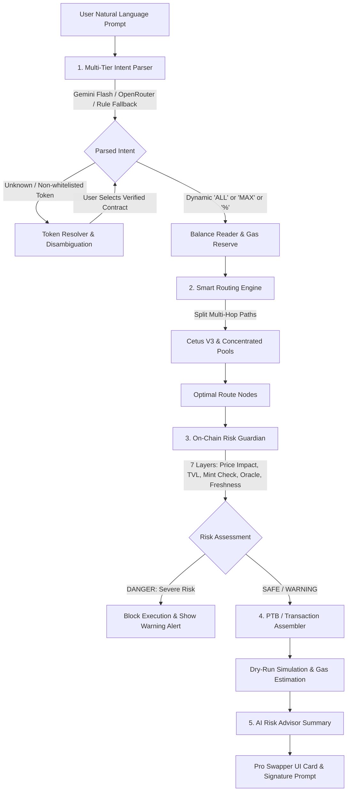

# 🧠 SOKA: AI-Powered Intent Execution Protocol

[](https://opensource.org/licenses/MIT)
[](https://react.dev/)
[](https://ai.google.dev/)
[](#)

**SOKA** is an AI-orchestrated intent execution protocol and liquidity routing engine. Users express what they want to trade in natural language (e.g. *"Swap 0.05 BTC for the safest route into MUSD"*, *"Đổi 100 MUSD sang BTC trượt giá thấp nhất"*, or *"Trade ALL SUI for USDC"*). SOKA's **Multi-Tier Intent Engine** parses the intent into a structured on-chain order, searches optimal liquidity paths across concentrated AMMs, runs every route through a **7-Layer On-Chain Risk Guardian**, and synthesizes an atomic transaction block ready for signature — with zero manual slippage math, no token address hunting, and complete protection against sandwich attacks.

---

## 📑 Table of Contents

1. [System Architecture & Processing Pipeline](#-1-system-architecture--processing-pipeline)
2. [Multi-Tier AI Intent Engine](#-2-multi-tier-ai-intent-engine)
3. [Smart Routing & Liquidity Optimization](#-3-smart-routing--liquidity-optimization)
4. [7-Layer On-Chain Risk Guardian](#-4-7-layer-on-chain-risk-guardian)
5. [Dynamic Balances & Alternative Funding](#-5-dynamic-balances--alternative-funding)
6. [Pro Studio Interface](#-6-pro-studio-interface)
7. [API Reference](#-7-api-reference)
8. [Codebase & Directory Structure](#-8-codebase--directory-structure)
9. [Local Development & Setup](#-9-local-development--setup)
10. [License](#-10-license)

---

## 🌊 1. System Architecture & Processing Pipeline

SOKA executes trades through an end-to-end 5-stage pipeline orchestrated by `/api/process-intent`:



### The 5 Pipeline Stages:

1. **Multi-Tier Intent Parsing (LLM + Rule Fallback):**
   - Natural language is analyzed to extract quantitative fields (`trade_amount`, `source_token`, `destination_token`) and qualitative constraints (`SAFE`, `FAST`, `MAX_OUTPUT`, slippage tolerance).
   - Supports shorthand values (`ALL`, `MAX`, percentages like `50%`), multivariant coin names, and full contract addresses.

2. **Token Resolution & Safety Whitelist:**
   - Evaluates symbols against a curated core whitelist (`BTC`, `MUSD`, `MEZO`, `SUI`, `USDC`, `USDT`, `DEEP`, `WAL`, etc.) and an extended 900+ token on-chain registry (`cetus-tokens.json`).
   - If a symbol is ambiguous or non-whitelisted, SOKA presents verified alternatives with on-chain metadata instead of guessing.

3. **Smart Routing & Pathfinding:**
   - Evaluates multi-hop split routes across liquidity pools (`byAmountIn`, up to 20 split paths, depth 3).
   - Optimizes execution price, fee tiers, and minimizes price impact.

4. **On-Chain Risk Guardian:**
   - Queries live on-chain state, pool TVL, contract mint authority, token deployment age, and oracle feeds.
   - Computes a mathematical risk score (0–100) and discrete health levels (`SAFE`, `WARNING`, `DANGER`).

5. **Atomic Transaction Assembly & Simulation:**
   - Compiles Programmable Transaction Blocks (PTB) with dynamic slippage boundaries and gas reserve deductions.
   - Executes dry-run RPC calls to verify balance changes prior to asking for user wallet signatures.

---

## 🧠 2. Multi-Tier AI Intent Engine

SOKA features a fail-safe, 3-tier parsing architecture that guarantees zero service disruption:

| Tier | Engine | Implementation | When Used |
|---|---|---|---|
| **Tier 1** | **Google Gemini Flash** (`gemini-3.8-flash` / `2.5`) | `@google/genai` TypeScript SDK | Primary parser when `GEMINI_API_KEY` is configured. Latency < 1.5s with strict JSON schema. |
| **Tier 2** | **OpenRouter LLM Pool** | Multi-model candidate retry chain | Active when `OPENROUTER_API_KEY` is present. Handles model fallback automatically. |
| **Tier 3** | **Deterministic Rule Parser** | Offline RegEx & semantic extraction | Always available. Guarantees 100% uptime with zero external API dependencies. |

### Example Prompts Understood:
- *"Swap 0.05 BTC to MUSD, safest route"* → Amount: `0.05`, Source: `BTC`, Dest: `MUSD`, Priority: `SAFE`
- *"Đổi 100 MUSD sang BTC trượt giá thấp nhất"* → Amount: `100`, Source: `MUSD`, Dest: `BTC`, Priority: `SAFE`
- *"Trade ALL SUI for USDC with 0.5% slippage"* → Amount: `ALL`, Source: `SUI`, Dest: `USDC`, Constraint: `slippage: 0.5%`
- *"Sell half of my DEEP into SUI"* → Amount: `50%`, Source: `DEEP`, Dest: `SUI`

---

## ⚡ 3. Smart Routing & Liquidity Optimization

SOKA connects to concentrated-liquidity AMM protocols and aggregators (Cetus Protocol Aggregator V3, DeepBook, Kriya, Turbos, FlowX, Aftermath, Bluefin, Mezo Pools):

- **Multi-Hop Traversal:** If a direct pair lacks depth, the router finds intermediate hops (e.g. `BTC -> MUSD -> MEZO` or `DEEP -> SUI -> USDC`).
- **Dynamic Slippage Calculation:** Rather than static fixed tolerances, SOKA calculates optimal slippage mathematically based on trade USD value, route liquidity depth, observed price impact, and hop complexity:
  $$\text{Optimal Slippage} = f(\text{Price Impact}, \text{Pool Depth}, \text{Hop Count})$$
- **Gas Reserve Deduction:** When swapping native gas assets (`BTC` or `SUI`) using `"ALL"` or `"MAX"`, SOKA automatically reserves an adequate buffer for transaction execution fees, preventing out-of-gas transaction failures.

---

## 🛡️ 4. 7-Layer On-Chain Risk Guardian

Before any transaction can be signed, SOKA's deterministic **Risk Guardian** evaluates live on-chain parameters:

```
┌─────────────────────────────────────────────────────────────┐
│                   ON-CHAIN RISK GUARDIAN                    │
├─────────────────────────────────────────────────────────────┤
│ 1. Price Impact & Slippage   │ Max route impact vs fees     │
│ 2. Liquidity Risk Ratio      │ Trade size vs Pool TVL       │
│ 3. Pool Activity & Age       │ On-chain transaction recency │
│ 4. Token Minting Authority   │ Renounced vs Active Owner    │
│ 5. Supply Concentration      │ Pool depth vs Circulating    │
│ 6. Token Freshness           │ Honeypot & age checks        │
│ 7. Oracle Health & Staleness │ Feed heartbeat & deviation   │
└─────────────────────────────────────────────────────────────┘
```

1. **Price Impact / Slippage:**
   $$\text{Effective Impact} = \max(\text{Simulated Impact}_\%, \sum(\text{Pool Fee}_\%) \times 0.5)$$
   *(Impact $\ge 5.0\%$ triggers `DANGER` lock; $\ge 2.5\%$ triggers `WARNING`).*

2. **Liquidity Risk (Trade Impact Ratio):**
   $$\text{Impact Ratio} = \frac{\text{Trade USD}}{\text{Pool TVL} / 2} \times 100\%$$
   *(Ratio $> 20\%$ blocks execution to protect against sandwich attacks).*

3. **Pool Safety & Activity:**
   Validates timestamp of recent pool transactions to prevent trading on abandoned or vampire-drained pools.

4. **Token Safety & Minting Authority (Rug-Pull Prevention):**
   Checks whether the token creator retains arbitrary mint capabilities. Renounced or burned minting rights pass; unconstrained owner keys trigger a safety lock.

5. **Supply Concentration:**
   Calculates the ratio of pool liquidity against total on-chain circulating supply. Pools with $< 0.05\%$ of circulating supply in liquidity indicate extreme dev hoarding.

6. **Token Freshness (Honeypot Check):**
   Monitors contract deployment timestamps on-chain. Tokens younger than 24 hours trigger elevated warning badges.

7. **Oracle Health & Cross-Check:**
   Verifies feed update timestamps against maximum staleness thresholds and checks for non-zero/positive values.

---

## 💰 5. Dynamic Balances & Alternative Funding

- **Dynamic Quantities (`ALL`, `MAX`, `%`):** Automatically reads connected wallet balances directly via RPC, converts units according to token decimal precision, and reserves gas.
- **Alternative Funding Scanner:** If a user's wallet does not hold sufficient balance of the requested input asset, SOKA scans the wallet's other holdings for tokens with equivalent USD value and suggests a one-click alternative route:
  > *"You don't have enough BTC. You hold 150 MUSD (~$150.00). Pick MUSD to execute this trade instead."*

---

## 🎨 6. Pro Studio Interface

The SOKA frontend is built with React 19, Vite, and Tailwind CSS v4:

- **Editorial Stacking Cards Deck:** Smooth vertical card stacking for introducing the protocol philosophy, technical pillars, and execution terminal.
- **Generative Ink Background:** GPU-accelerated canvas background rendering fluid watercolor plumes without external asset bloat.
- **Pro Swapper Console:**
  - Natural language intent input bar with instant auto-suggestions.
  - Interactive **Route Visualizer** displaying multi-hop path splits, DEX ratios, and fee tiers.
  - **Guardian Radar**: Real-time multi-axis visualizer of the 7 safety layers.
  - **Swap History & Replay**: Persistent swap records with receipt links, execution status, and simulated dry-run details.

---

## 🔌 7. API Reference

All endpoints accept and return JSON. The API includes built-in rate limiting and strict Zod schema validation.

### `POST /api/process-intent`
The primary unified pipeline endpoint.
```json
// Request
{
  "prompt": "Swap 0.05 BTC to MUSD, safest route",
  "senderAddress": "0x1234...5678",
  "slippage": 0.5
}

// Response
{
  "intent": {
    "action_type": "SWAP",
    "trade_amount": "0.05",
    "source_token_symbol": "BTC",
    "source_token_address": "0x...",
    "destination_token_symbol": "MUSD",
    "destination_token_address": "0x...",
    "priority_mode": "SAFE"
  },
  "route": { ... },
  "guardian": {
    "safe": true,
    "score": 95,
    "riskLevel": "LOW",
    "checks": [ ... ]
  },
  "ptb": { ... },
  "tokenLogos": { "source": "...", "dest": "..." }
}
```

### `POST /api/parse-intent`
Direct natural-language parser endpoint.
```json
// Request
{ "prompt": "Trade 100 SUI to USDC" }

// Response
{
  "intent": { ... },
  "confidence_score": 0.95,
  "validation_status": "VALID"
}
```

### `POST /api/calculate-optimal-route`
Finds optimal liquidity route for given token addresses and amount.

### `POST /api/evaluate-guardian-risk`
Evaluates the 7 on-chain safety layers for an assembled route.

### `POST /api/risk-summary` & `POST /api/risk-advice`
Generates human-readable risk summaries and guidance from raw checks using AI.

### `POST /api/balance`
Retrieves formatted on-chain token balance for an address.

### `POST /api/execute-swap`
Assembles signed transaction bytes for the final swap PTB.

---

## 📂 8. Codebase & Directory Structure

```
├── .env.example                  # Environment template
├── LICENSE                       # MIT License
├── README.md                     # Documentation
├── package.json                  # Dependencies & build scripts
├── server.ts                     # Express + Vite SSR entry point
│
├── backend/                      # Backend Service Core
│   ├── src/
│   │   ├── api/
│   │   │   ├── routes.ts         # REST API routes & controllers
│   │   │   └── middleware.ts     # Zod validation & rate limiter
│   │   ├── config/
│   │   │   ├── index.ts          # Environment & threshold configs
│   │   │   └── constant.ts       # Core Token Whitelist
│   │   ├── services/
│   │   │   ├── llm/
│   │   │   │   ├── intentParser.ts  # Gemini + OpenRouter + Rule parser
│   │   │   │   ├── riskAdvisor.ts   # Risk synthesis & summaries
│   │   │   │   └── tokenAdvisor.ts  # Fuzzy match & candidate advisor
│   │   │   ├── router/
│   │   │   │   ├── cetusRouter.ts   # Aggregator V3 liquidity pathfinder
│   │   │   │   └── ptbBuilder.ts    # Programmable Transaction Block builder
│   │   │   ├── risk/
│   │   │   │   └── LiquidityRiskGuardian.ts # 7-layer risk engine
│   │   │   ├── safety/
│   │   │   │   ├── PoolSafety.ts    # Pool age & activity checker
│   │   │   │   └── TokenSafety.ts   # Mint authority & honeypot detector
│   │   │   └── coin/
│   │   │       ├── tokenResolver.ts # 900+ token registry lookup
│   │   │       ├── coinService.ts   # On-chain RPC balance reader
│   │   │       └── alternativeSource.ts # Wallet funding scanner
│   │   └── utils/
│   │       ├── logger.ts         # Winston structured logger
│   │       └── suiClient.ts      # RPC client singleton
│
└── src/                          # Frontend Application (React 19)
    ├── main.tsx                  # Root providers & client setup
    ├── App.tsx                   # Route definitions
    ├── cetus-tokens.json         # 900+ token metadata registry
    └── components/
        └── pro/
            ├── ProLanding.tsx    # Editorial landing page
            ├── ProSwapper.tsx    # Interactive terminal & console
            ├── ProRouteVisualizer.tsx # Visual route path graph
            ├── ProGuardianRadar.tsx   # 7-layer radar visualizer
            ├── GenerativeInkCanvas.tsx# Fluid background canvas
            └── HistoryPanel.tsx  # Swap session history
```

---

## 💻 9. Local Development & Setup

### Prerequisites
- **Node.js**: v18.0.0 or higher
- **npm** (or **bun** / **yarn**)

### 1. Clone & Install
```bash
git clone https://github.com/Tinacooking/Soka.git
cd Soka
npm install
```

### 2. Environment Configuration
Copy `.env.example` to `.env`:
```bash
cp .env.example .env
```

Configure your environment variables:
```env
# AI Model Configuration (Optional but recommended)
GEMINI_API_KEY=your_gemini_api_key_here
OPENROUTER_API_KEY=your_openrouter_api_key_here

# Network & RPC
SUI_RPC_ENDPOINT=https://fullnode.mainnet.sui.io:443
LOG_LEVEL=info
```
> *Note: SOKA includes a deterministic offline parser. If no AI keys are set, trading intent parsing falls back to the internal rule engine automatically.*

### 3. Run Development Server
```bash
npm run dev
```
The application will launch at `http://localhost:3000`.

### 4. Build for Production
```bash
npm run build
npm run start
```

### 5. Run Typechecks & Linting
```bash
npm run lint
```

---

## 📄 10. License

This project is licensed under the **MIT License**. See the [LICENSE](LICENSE) file for complete details.
